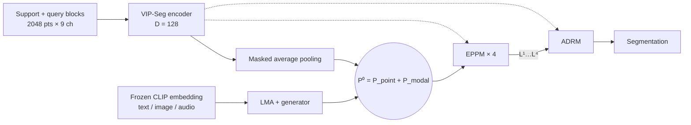

# CascadeProto (unofficial re-implementation)

Re-implementation of **CascadeProto: Cascaded Cross-Modal Prototype Purification via Entropy-Aware Learning for Few-Shot 3D Point Cloud Segmentation** (Changshuo Wang, Weijun Li, Fan Mo, Zhonghang Liu, Shuting He, Prayag Tiwari, Dimitrios Kanoulas).

> **Status: work in progress, not usable for results.**
> * This is **not** the authors' code. Their repository `github.com/changshuowang/CascadeProto` says "We will release it soon." (checked 2026-09-17).
> * The specifications in [`docs/spec/`](docs/spec/) were rewritten against the paper on 2026-09-17. The code in `models/`, `loss/`, `train.py`, `eval.py` and `tests/` predates that rewrite and does not follow it yet. Phase 9 (2026-09-18) moved `train.py` and `eval.py` onto real episodes; the model in `models/` is still the pre-rewrite one. See [the audit](docs/research/paper_vs_repo_audit.md).
> * All numbers in §6 are **reported by the paper**; none have been reproduced here.

---

## 1. Method in brief

CascadeProto builds on the VIP-Seg few-shot segmentation network, trained from scratch without point-cloud pre-training:

1. A shared VIP-Seg encoder turns every support and query block into 128-d point features; masked average pooling gives one prototype per class plus background.
2. A **Learnable Modality Adapter (LMA)** maps a frozen CLIP embedding of one modality (text, image or audio) to a modal prototype, aligned with the point prototype by foreground/background-decoupled MMD. Point and modal prototypes are summed.
3. **T = 4 cascaded Entropy-aware Prototype Purification Modules (EPPM)** refine the prototype with Shannon-entropy gating, query–support cross-attention, prototype diffusion and adaptive fusion; each stage produces logits.
4. An **Attention-based Dynamic Routing Mechanism (ADRM)** mixes the four stage logits with query-conditioned weights.



Exact formulas, shapes and the interpretation of ambiguous equations are in the specs, not here.

---

## 2. Documentation

| Document | Content |
| :--- | :--- |
| [00_SOURCES_AND_DECISIONS.md](docs/spec/00_SOURCES_AND_DECISIONS.md) | Source hierarchy (paper → pinned VIP-Seg code → decisions) and decision log D-01…D-17 |
| [01_ARCHITECTURE_SPEC.md](docs/spec/01_ARCHITECTURE_SPEC.md) | Modules, wiring, ablation switches, parameter budget |
| [02_TENSOR_MATH_SPEC.md](docs/spec/02_TENSOR_MATH_SPEC.md) | Every formula and tensor shape |
| [03_MULTIMODAL_SPEC.md](docs/spec/03_MULTIMODAL_SPEC.md) | Modality front-ends, adapters, GMMN loss rules |
| [04_DATA_AND_EPISODES.md](docs/spec/04_DATA_AND_EPISODES.md) | Data layout, class splits, episodes, schedule, evaluation metric |
| [05_VERIFICATION_PLAN.md](docs/spec/05_VERIFICATION_PLAN.md) | Tests, gates, acceptance criteria |
| [paper_vs_repo_audit.md](docs/research/paper_vs_repo_audit.md) | Audit of the current code against the paper |
| [AGENTS.md](AGENTS.md) | Rules for coding agents |

---

## 3. Environment

* **Python 3.9 on Linux or WSL2, one CUDA GPU.** The inherited preprocessing splits paths on `/` and does not work on native Windows.
* **PyTorch with CUDA.** VIP-Seg documents `torch==1.13.1+cu117` on an RTX 4090. The paper trained CascadeProto on an **RTX 5090**, which needs CUDA 12.8; this repository pins `torch==2.7.1+cu128`, the last release line that supports Python 3.9.
* **Install** (order matters; `mamba_ssm` and `pointnet2_ops` are required and have no fallback):
  ```bash
  pip install torch==2.7.1 torchvision==0.22.1 --index-url https://download.pytorch.org/whl/cu128
  pip install -r requirements.txt
  pip install -U pip setuptools wheel packaging ninja   # build tools for --no-build-isolation
  pip install --no-build-isolation causal-conv1d==1.5.3.post1 mamba-ssm==2.2.6.post3
  pip install --no-build-isolation ./pointnet2_ops_lib
  pytest tests/test_environment.py -v   # gate G0
  ```
  `requirements.txt` explains the pinned versions. Known issue: `pointnet2_ops_lib/setup.py` hard-codes a CUDA arch list starting at `3.7`, which nvcc 12.x rejects; the fix is planned (00 §5.3).

---

## 4. Data preparation

Follow the AttMPTI protocol used by VIP-Seg. Preprocessed blocks can also be downloaded from COSeg (both linked from the VIP-Seg README). Target layout and all loader arguments are specified in [04 §2](docs/spec/04_DATA_AND_EPISODES.md).

### S3DIS

One command (Linux or WSL2, about 4.4 GB download plus 30-60 min of processing):

```bash
python preprocess/prepare_s3dis.py              # add --delete_raw to drop the zip and raw txt afterwards
```

It downloads `Stanford3dDataset_v1.2_Aligned_Version.zip` from a public Hugging Face backup (resumable, SHA-256 checked), strips the stray character in `Area_5/hallway_6`, writes `datasets/S3DIS/meta/s3dis_classnames.txt`, runs the inherited `collect_s3dis_data.py` and `room2blocks.py` unchanged, and fails if a room was skipped. `HF_TOKEN` is optional (see `.env.example`). Use `datasets/S3DIS/blocks_bs1_s1` as `--data_path`; the loader reads `datasets/S3DIS/meta/` next to it.

### ScanNet v2

1. Place the scans in `datasets/ScanNet/scans/` and provide `datasets/ScanNet/meta/scannet_classnames.txt` (21 lines, `unannotated` first) and `datasets/ScanNet/meta/scannetv2-labels.combined.tsv`.
2. Run:
   ```bash
   python preprocess/collect_scannet_data.py --data_path datasets/ScanNet/scans
   python preprocess/room2blocks.py --data_path datasets/ScanNet/scenes --dataset scannet   # writes datasets/ScanNet/blocks_bs1_s1
   ```

### Splits and protocol (summary)

* Class-based folds of the inherited loader. S3DIS S0 test classes: beam, board, bookcase, ceiling, chair, column; S1: door, floor, sofa, table, wall, window. ScanNet folds: 10 test classes each ([04 §3](docs/spec/04_DATA_AND_EPISODES.md)).
* Evaluation: 100 fixed episodes per test-class combination, IoU accumulated per class over all episodes, background excluded; S0, S1 and their average are reported ([04 §6](docs/spec/04_DATA_AND_EPISODES.md)).

---

## 5. Training and evaluation

`train.py` and `eval.py` read real episodes only. The CascadeProto model itself is rewritten in the next phases, so do not report its numbers yet.

```bash
D=datasets/S3DIS/blocks_bs1_s1
python train.py --dataset s3dis --data_path $D --cvfold 0 --n_way 2 --k_shot 1 --dry_run true   # one step on real data
python train.py --dataset s3dis --data_path $D --cvfold 0 --n_way 2 --k_shot 1                  # full schedule
python eval.py  --dataset s3dis --data_path $D --cvfold 0 --n_way 2 --k_shot 1 \
                --checkpoint log_cascadeproto/s3dis_S0_N2_K1_text/best.pt                         # also evaluate last.pt (D-15)
```

The schedule is fixed by the specs:

| Setting | Value | Spec |
| :--- | :--- | :--- |
| Optimiser | AdamW, lr 1e-3, weight decay 0.1, StepLR ×0.5 every 10 epochs | [04 §5](docs/spec/04_DATA_AND_EPISODES.md) |
| Batch / epochs | 4 episodes; S3DIS 50 epochs × 480 episodes; ScanNet 30 epochs × 800 episodes | [04 §5](docs/spec/04_DATA_AND_EPISODES.md) |
| Settings | 2/3-way × 1/5-shot × folds S0/S1 × modality | [04 §3](docs/spec/04_DATA_AND_EPISODES.md) |
| First check | `python train.py ... --dry_run true` on real data | [05 §3.10](docs/spec/05_VERIFICATION_PLAN.md) |

Before training CascadeProto, the data and metric pipeline must come close to VIP-Seg's logged result for its released S0 2-way 1-shot checkpoint (mean IoU 0.722) ([05 §4](docs/spec/05_VERIFICATION_PLAN.md)):

```bash
wget https://github.com/changshuowang/VIP-Seg_NeurIPS2025/raw/28aedc5093c0d386d526864c49505ae6921b1600/log_s3dis_VIPSeg/log_S0_N2_K1_0.722026/checkpoint.pt -O vipseg_S0_N2_K1.pt
python eval.py --model vipseg --checkpoint vipseg_S0_N2_K1.pt --dataset s3dis --data_path $D --cvfold 0 --n_way 2 --k_shot 1
```

---

## 6. Results reported in the paper

mIoU (%), average of splits S0 and S1. Selected rows; the paper's tables list more baselines.

### S3DIS (paper Table 2)

| Method | Backbone | Modality | 2-way 1-shot | 2-way 5-shot | 3-way 1-shot | 3-way 5-shot |
| :--- | :--- | :--- | ---: | ---: | ---: | ---: |
| DGCNN | DGCNN | Point | 37.57 | 56.74 | 31.12 | 47.23 |
| AttMPTI | DGCNN | Point | 54.86 | 64.35 | 47.23 | 55.86 |
| PAP3D | DGCNN | Text + Point | 62.76 | 67.85 | 52.78 | 61.04 |
| Seg-PN | Seg-PN | Point | 66.41 | 69.56 | 59.77 | 62.10 |
| VIP-Seg | VIP-Seg | Point | 74.15 | 77.01 | 68.58 | 69.30 |
| CascadeProto (Audio) | VIP-Seg | Audio + Point | 85.65 | 86.20 | 80.50 | 80.48 |
| CascadeProto (Image) | VIP-Seg | Image + Point | 85.91 | 86.36 | 80.23 | 79.31 |
| CascadeProto (Text) | VIP-Seg | Text + Point | 86.53 | 86.68 | 81.06 | 78.95 |

### ScanNet (paper Table 3)

| Method | Backbone | Modality | 2-way 1-shot | 2-way 5-shot | 3-way 1-shot | 3-way 5-shot |
| :--- | :--- | :--- | ---: | ---: | ---: | ---: |
| AttMPTI | DGCNN | Point | 41.69 | 52.16 | 32.98 | 43.77 |
| Seg-PN | Seg-PN | Point | 63.74 | 68.07 | 63.57 | 65.60 |
| VIP-Seg | VIP-Seg | Point | 72.12 | 72.63 | 70.13 | 71.28 |
| CascadeProto (Audio) | VIP-Seg | Audio + Point | 78.88 | 79.43 | 77.99 | 78.53 |
| CascadeProto (Image) | VIP-Seg | Image + Point | 78.98 | 79.15 | 77.85 | 76.75 |
| CascadeProto (Text) | VIP-Seg | Text + Point | 79.57 | 79.25 | 78.24 | 78.60 |

### Complexity, S3DIS S0, 2-way 1-shot (paper Table 6)

| Method | Params (M) | FLOPs (G) | mIoU (%) |
| :--- | ---: | ---: | ---: |
| AttMPTI | 0.36 | 152.65 | 53.77 |
| QGPA | 2.79 | 16.30 | 56.30 |
| PAP3D | 2.57 | 15.05 | 59.45 |
| DPA | 5.08 | 15.67 | 66.08 |
| Seg-PN | 0.24 | 8.36 | 64.84 |
| VIP-Seg | 2.76 | 8.48 | 72.20 |
| CascadeProto | 2.88 | 8.86 | 88.53 |

The mIoU column of Table 6 is the S0 value only, so CascadeProto's 88.53 corresponds to the S0 column of Table 2 (Avg 86.53). The parameter budget of this re-implementation differs from Table 6; see [01 §4](docs/spec/01_ARCHITECTURE_SPEC.md).

---

## 7. Citation and acknowledgements

The PDF used for this re-implementation does not state a venue. Cite the paper as published by its authors; a provisional entry:

```bibtex
@misc{wang_cascadeproto,
  title  = {CascadeProto: Cascaded Cross-Modal Prototype Purification via Entropy-Aware Learning for Few-Shot 3D Point Cloud Segmentation},
  author = {Wang, Changshuo and Li, Weijun and Mo, Fan and Liu, Zhonghang and He, Shuting and Tiwari, Prayag and Kanoulas, Dimitrios}
}
```

This repository inherits code from [VIP-Seg](https://github.com/changshuowang/VIP-Seg_NeurIPS2025) (NeurIPS 2025) and, through it, from [attMPTI](https://github.com/Na-Z/attMPTI).
