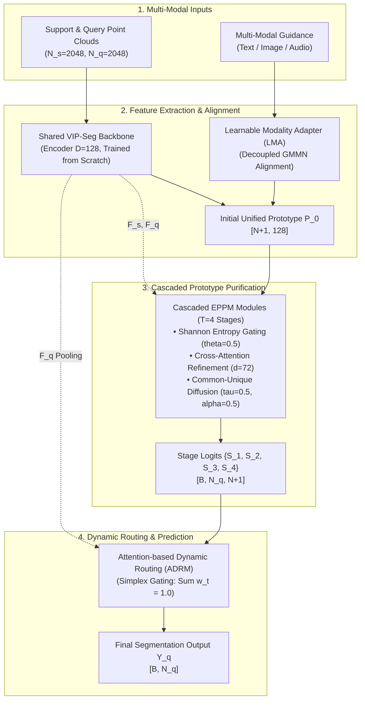

# CascadeProto: Cascaded Cross-Modal Prototype Purification via Entropy-Aware Learning for Few-Shot 3D Point Cloud Semantic Segmentation

Official PyTorch implementation of **CascadeProto**. This codebase provides complete training and evaluation pipelines for few-shot 3D point cloud semantic segmentation on the **S3DIS** and **ScanNet** benchmarks.

---

## 1. Overview

CascadeProto is a pre-training-free framework that distills clean prototypes from noisy point cloud initializations using cascaded information-theoretic purification and single-modality cross-modal alignment.



### Key Technical Properties
* **Pre-training-free:** Trains from scratch within an episodic meta-learning scheme without backbone pre-training weights.
* **Decoupled Cross-Modal Alignment (LMA):** Uses Generative Moment Matching Networks (GMMN) with multi-scale RBF kernels ($\sigma \in \{2, 5, 10, 20, 40, 80\}$) to project CLIP text, image, or audio embeddings into geometric feature space with separate foreground ($1.0$) and background ($0.1$) objectives.
* **Entropy-Aware Prototype Purification (EPPM):** Suppresses high-entropy background channels and enhances low-entropy foreground channels across $T = 4$ cascade stages.
* **Dynamic Multi-Stage Aggregation (ADRM):** Dynamically weights stage predictions via a softmax probability simplex ($\sum_{t=1}^4 w_{gate}^{(t)} = 1.0$) based on per-query scene complexity.

---

## 2. Technical Documentation & Specifications

For comprehensive architectural specifications, mathematical formulations, and verification plans, refer to the documentation suite:

* [01_ARCHITECTURE_SPEC.md](docs/spec/01_ARCHITECTURE_SPEC.md) — Structural design, layer dimensions ($D=128, d=72, T=4$), and sub-module dataflow.
* [02_TENSOR_MATH_SPEC.md](docs/spec/02_TENSOR_MATH_SPEC.md) — Mathematical bounds, Shannon entropy clamping, and loss functions.
* [03_MULTIMODAL_SPEC.md](docs/spec/03_MULTIMODAL_SPEC.md) — CLIP adapter pipelines, GMMN generator, and multi-scale RBF kernels.
* [04_DATA_AND_EPISODES.md](docs/spec/04_DATA_AND_EPISODES.md) — S3DIS/ScanNet splits, block sampling ($N_p=2048, \ge 50$ points), and local remapping.
* [05_VERIFICATION_PLAN.md](docs/spec/05_VERIFICATION_PLAN.md) — 3-phase testing pipeline, unit tests, and acceptance matrix.
* [AGENTS.md](AGENTS.md) — Machine operating protocols and Task-to-Spec Routing Matrix for AI coding agents.

---

## 3. Environment Setup

### System Prerequisites
* **OS:** Linux (Ubuntu 20.04/22.04 LTS recommended)
* **GPU:** NVIDIA GPU with $\ge 16$ GB VRAM (verified on NVIDIA RTX 5090)
* **CUDA:** Version 11.7 or higher
* **Python:** 3.8+

### Installation

```bash
# 1. Clone repository
git clone https://github.com/changshuowang/CascadeProto.git
cd CascadeProto

# 2. Create and activate virtual environment (.venv)
python -m venv .venv
source .venv/bin/activate  # On Windows use: .venv\Scripts\activate

# 3. Install PyTorch ecosystem matching your CUDA version (e.g., CUDA 11.8)
pip install torch==2.0.1 torchvision==0.15.2 torchaudio==2.0.2 --index-url https://download.pytorch.org/whl/cu118

# 4. Install official OpenAI CLIP
pip install git+https://github.com/openai/CLIP.git

# 5. Install point cloud processing and general dependencies
pip install -r requirements.txt
```

---

## 4. Dataset Preparation

### S3DIS (Stanford 3D Indoor Semantics Dataset)

1. Download `Stanford3dDataset_v1.2_Aligned_Version.zip`.
2. Preprocess raw point clouds into block-based `.npy` files ($N_p = 2048$ points per block):

```bash
python dataloaders/preprocessing/collect_s3dis_data.py --data_path /path/to/S3DIS_raw
python dataloaders/preprocessing/room2blocks.py --data_path /path/to/S3DIS_raw --save_path data/s3dis/blocks
```

3. Category splits:
   * **Training Areas:** Areas 1, 2, 3, 4, 6.
   * **Testing Area:** Area 5.
   * **Split $S_0$ Unseen Classes:** `{ceiling, floor, wall, beam, column, window}`.
   * **Split $S_1$ Unseen Classes:** `{door, chair, table, bookcase, sofa, board}`.

### ScanNet v2

1. Download ScanNet v2 `.sens` files and extract point clouds using the official tool suite.
2. Sample point clouds into uniform 2048-point blocks:

```bash
python dataloaders/preprocessing/prepare_scannet_blocks.py --source_dir /path/to/ScanNet_v2 --output_dir data/scannet/blocks
```

3. Split configuration:
   * **Training Scenes:** 1,201 scenes.
   * **Validation Scenes:** 312 scenes (partitioned into 36,350 blocks).

---

## 5. Model Zoo & Benchmarks

All metrics denote **mean Intersection-over-Union (mIoU %)** averaged over Splits $S_0$ and $S_1$ across 600 randomly sampled test episodes.

### S3DIS Benchmark (Table 2)

| Method | Backbone | Modality | 2-Way 1-Shot | 2-Way 5-Shot | 3-Way 1-Shot | 3-Way 5-Shot |
| :--- | :--- | :--- | :--- | :--- | :--- | :--- |
| DGCNN | DGCNN | Point | 37.57 | 56.74 | 31.12 | 47.23 |
| AttMPTI | DGCNN | Point | 54.86 | 64.35 | 47.23 | 55.86 |
| PAP3D | DGCNN | Text + Point | 62.76 | 67.85 | 52.78 | 61.04 |
| Seg-PN | Seg-PN | Point | 66.41 | 69.56 | 59.77 | 62.10 |
| VIP-Seg | VIP-Seg | Point | 74.15 | 77.01 | 68.58 | 69.30 |
| **CascadeProto (Audio)** | **VIP-Seg** | **Audio + Point** | **85.65** | **86.20** | **80.50** | **80.48** |
| **CascadeProto (Image)** | **VIP-Seg** | **Image + Point** | **85.91** | **86.36** | **80.23** | **79.31** |
| **CascadeProto (Text)** | **VIP-Seg** | **Text + Point** | **86.53** | **86.68** | **81.06** | **78.95** |

### ScanNet Benchmark (Table 3)

| Method | Backbone | Modality | 2-Way 1-Shot | 2-Way 5-Shot | 3-Way 1-Shot | 3-Way 5-Shot |
| :--- | :--- | :--- | :--- | :--- | :--- | :--- |
| AttMPTI | DGCNN | Point | 41.69 | 52.16 | 32.98 | 43.77 |
| Seg-PN | Seg-PN | Point | 63.74 | 68.07 | 63.57 | 65.60 |
| VIP-Seg | VIP-Seg | Point | 72.12 | 72.63 | 70.13 | 71.28 |
| **CascadeProto (Audio)** | **VIP-Seg** | **Audio + Point** | **78.88** | **79.43** | **77.99** | **78.53** |
| **CascadeProto (Image)** | **VIP-Seg** | **Image + Point** | **78.98** | **79.15** | **77.85** | **76.75** |
| **CascadeProto (Text)** | **VIP-Seg** | **Text + Point** | **79.57** | **79.25** | **78.24** | **78.60** |

### Computational Complexity on S3DIS $S_0$ (Table 6)

| Method | Parameters (M) | FLOPs (G) | mIoU (%) (2-Way 1-Shot) |
| :--- | :--- | :--- | :--- |
| AttMPTI | 0.36 | 152.65 | 53.77 |
| PAP3D | 2.57 | 15.05 | 59.45 |
| DPA | 5.08 | 15.67 | 66.08 |
| Seg-PN | 0.24 | 8.36 | 64.84 |
| VIP-Seg | 2.76 | 8.48 | 72.20 |
| **CascadeProto (Ours)** | **2.88** | **8.86** | **88.53** |

---

## 6. Training & Evaluation Pipeline

### Training (Text Modality Baseline)

To train CascadeProto on S3DIS with Split $S_0$ under the 2-way 1-shot setting:

```bash
python train.py \
    --dataset s3dis \
    --data_path data/s3dis/blocks \
    --cvfold 0 \
    --n_way 2 \
    --k_shot 1 \
    --modality text \
    --batch_size 4 \
    --epochs 50 \
    --lr 0.001 \
    --weight_decay 0.1 \
    --step_size 10 \
    --gamma 0.5 \
    --cascade_t 4 \
    --save_dir checkpoints/s3dis_text_2w1s_s0
```

### Evaluation (600 Episodes)

To evaluate a trained checkpoint on Area 5 across 600 randomly sampled episodes:

```bash
python eval.py \
    --dataset s3dis \
    --data_path data/s3dis/blocks \
    --cvfold 0 \
    --n_way 2 \
    --k_shot 1 \
    --modality text \
    --num_episodes 600 \
    --checkpoint checkpoints/s3dis_text_2w1s_s0/best_model.pth
```

### Reproducing ScanNet Configurations

```bash
python train.py \
    --dataset scannet \
    --data_path data/scannet/blocks \
    --cvfold 0 \
    --n_way 2 \
    --k_shot 1 \
    --modality text \
    --batch_size 4 \
    --epochs 30 \
    --lr 0.001 \
    --cascade_t 4 \
    --save_dir checkpoints/scannet_text_2w1s_s0
```

---

## 7. Citation

If you find this work or codebase useful in your research, please cite:

```bibtex
@inproceedings{wang2026cascadeproto,
  title     = {CascadeProto: Cascaded Cross-Modal Prototype Purification via Entropy-Aware Learning for Few-Shot 3D Point Cloud Segmentation},
  author    = {Wang, Changshuo and Li, Weijun and Mo, Fan and Liu, Zhonghang and He, Shuting and Tiwari, Prayag and Kanoulas, Dimitrios},
  booktitle = {Proceedings of the European Conference on Computer Vision (ECCV)},
  year      = {2026}
}
```
