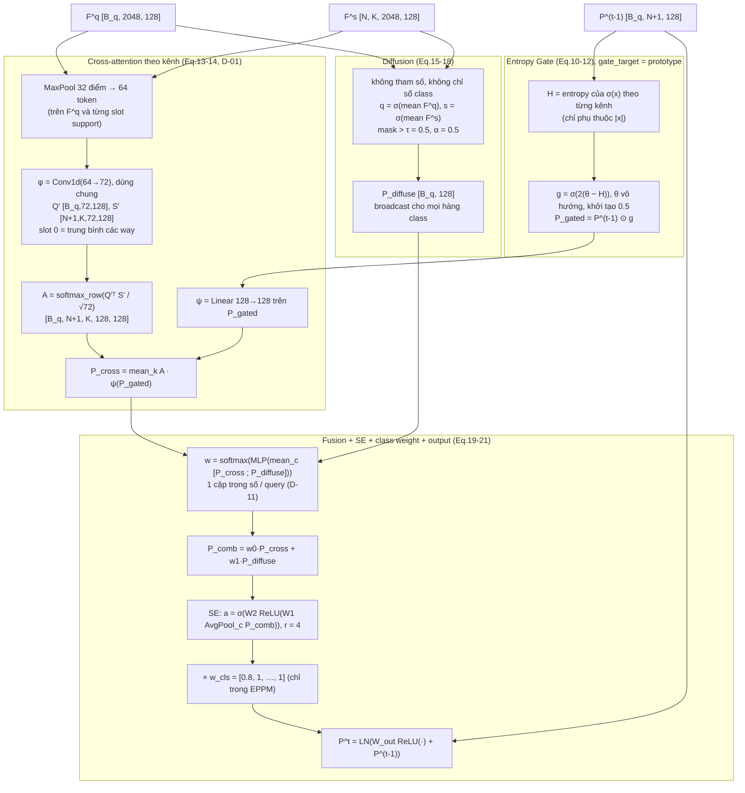

# Kiến trúc tái lập CascadeProto (route A) so với Fig. 2 của paper

Ngày 2026-09-30. Sơ đồ này vẽ **bản tái lập ban đầu** (phase 8–15, route A, `stage_type=eppm`). Nó không gồm các
module phase 16:
* route B (`vip`, `vip_clean`);
* neck;
* self-support, proto-align, VICReg;
* correlation head;
* image và audio của D-47.

Mọi khối đều đọc trực tiếp từ code, có trỏ file:dòng.

Cấu hình mặc định của model đầy đủ (hàng "+ ADRM" của Table 4): `use_lma=true`, `num_stages=4`, `use_gate=true`,
`use_adrm=true`, `modality=text`, `stage_type=eppm`, `gate_target=prototype`, `cross_attn=channel`,
`cross_attn_support=class_slots`, `fusion_weight=per_query`, `l2norm_point_proto=false`
(`models/cascadeproto.py:73-110`).

## 1. Sơ đồ kiến trúc tái lập

Ảnh render sẵn: [toàn bộ model](figures/2026-09-30_route_a_overview.png), [một stage EPPM](figures/2026-09-30_route_a_eppm.png). Mã Mermaid bên dưới hiển thị trực tiếp trên GitHub.

```mermaid
flowchart LR
    %% ---------------- modality branch ----------------
    subgraph MOD["Nhánh modality (chỉ TEXT trong bản tái lập)"]
        direction LR
        T["Prompt văn bản<br/>'This point cloud represents the {class}.'<br/>+ hàng background<br/>'...the background.'"]
        CLIP["CLIP ViT-B/16 text encoder<br/>(frozen, ngoài state_dict)"]
        E["E_CLIP [N+1, 512]"]
        subgraph LMA["LMA: Learnable Modality Adapter"]
            direction TB
            AD["Adapter<br/>Linear 512→128 → LN → ReLU → Dropout 0.1 → Linear 128→128"]
            Z["z ~ N(0, I) khi train<br/>z = 0 khi eval"]
            G["Generator G<br/>MLP 3 lớp trên [E_adapted ; z] 256→128→128→128"]
            AD --> G
            Z --> G
        end
        T --> CLIP --> E --> AD
    end

    %% ---------------- point branch ----------------
    XS["Support X^s<br/>[N·K, 2048, 9] xyzrgbXYZ"]
    XQ["Query X^q<br/>[B_q, 2048, 9]"]
    subgraph BB["Backbone chung (VIP-Seg encoder, train từ đầu)"]
        direction TB
        ENC["Encoder Mamba + DyPowerConv<br/>input: XYZ chuẩn hoá theo block + rgb<br/>→ 900-d"]
        HEAD["L2 norm → BN+ReLU → Conv 900→196 → BN+ReLU<br/>→ Conv 196→128 → BN+ReLU"]
        ENC --> HEAD
    end
    XS --> ENC
    XQ --> ENC
    FS["F^s [N, K, 2048, 128]"]
    FQ["F^q [B_q, 2048, 128]"]
    HEAD --> FS
    HEAD --> FQ

    MASK["Support mask Y^s<br/>nhị phân {0,1}"]
    MAP["Masked Average Pooling (Eq.3)<br/>fg: trung bình theo từng way qua K shot<br/>bg: mọi điểm mask 0 của mọi way và shot"]
    PP["P_point [N+1, 128]<br/>(không L2 norm)"]
    FS --> MAP
    MASK --> MAP
    MAP --> PP

    PM["P_modal [N+1, 128]"]
    G --> PM
    GMMN(["L_GMMN = 0.1·MMD²(bg) + 1.0·MMD²(fg, 1 tập)<br/>RBF σ ∈ {2,5,10,20,40,80}"])
    PM --> GMMN
    PP --> GMMN

    SUM(("⊕"))
    PP --> SUM
    PM --> SUM
    P0["P^0 = P_point + P_modal (Eq.9)<br/>chép cho mỗi query → [B_q, N+1, 128]"]
    SUM --> P0

    %% ---------------- cascade ----------------
    subgraph CASC["Cascade EPPM, T = 4 stage, mỗi stage tham số riêng"]
        direction LR
        E1["EPPM_1"] --> E2["EPPM_2"] --> E3["EPPM_3"] --> E4["EPPM_4"]
    end
    P0 --> E1
    FS -.-> CASC
    FQ -.-> CASC

    subgraph OUT["Đầu ra"]
        direction TB
        LT["L^t = F^q (P^t)ᵀ<br/>[B_q, 2048, N+1], không temperature"]
        ADRM["ADRM<br/>w = softmax(W_g · AvgPool(F^q)), W_g ∈ R^{4×128}, không bias<br/>L_final = Σ_t w_t L^t"]
        LT --> ADRM
    end
    E1 --> LT
    E2 --> LT
    E3 --> LT
    E4 --> LT
    FQ --> ADRM
    SEG(["L_total = CE(L_final, Y^q) + 1.0·L_GMMN<br/>CE không trọng số"])
    ADRM --> SEG
    YHAT["Ŷ^q = argmax L_final"]
    ADRM --> YHAT
    GMMN --> SEG
```

### 1.1 Bên trong một stage EPPM_t (`models/eppm.py`)

## 2. So khớp từng khối với Fig. 2 của paper

| # | Khối trong Fig. 2 | Bản tái lập (code) | Giống / khác | Nguồn |
| :--- | :--- | :--- | :--- | :--- |
| 1 | Audio → Whisper, Text, Image → **CLIP**, cả 3 modality cùng vào | **Chỉ text**, một modality mỗi lần chạy. Image và audio chỉ được thêm sau (D-47, mức class), không có trong bản tái lập ban đầu | **Khác**: hình vẽ 3 modality song song; paper không nói rõ cách trộn, D-05 chọn E_fused = E_adapted của modality duy nhất | `models/cascadeproto.py:42-56`, `models/lma.py:44-74`, D-05, D-13 |
| 2 | Prompt "This point cloud represents the chair." | Đúng prompt này; thêm prompt cho hàng background ("…the background.") | Giống; hàng background là lựa chọn của mình (paper không in) | `models/clip_text.py:16-26`, D-13 |
| 3 | CLIP | CLIP ViT-B/16 text, frozen, không nằm trong state_dict | Biến thể CLIP do mình chọn (paper không in) | `models/clip_text.py:15`, D-13 |
| 4 | Learnable Modality Adapter → Audio/Text/Image Prototypes | Adapter (Linear→LN→ReLU→Dropout→Linear) + Generator MLP 3 lớp trên [E; z]; z = 0 khi eval | Cấu trúc lớp, dropout và z lúc eval là do mình chọn | `models/lma.py`, D-06, D-16 |
| 5 | L_GMMN nối từ modal prototypes | MMD² giữa P_modal và P_point: bg trọng số 0.1, fg 1.0, fg coi là **một tập**, σ ∈ {2…80} | Giống ý; "fg một tập" (D-04) nghĩa là không ràng buộc hàng nào ứng với class nào | `loss/gmmn_loss.py`, D-04 |
| 6 | Support mask → (M) → Point Prototypes | Masked average pooling: fg theo từng way; bg từ mọi điểm mask 0; **không L2 norm** | Giống. Riêng L2 norm: VIP-Seg có chuẩn hoá, paper không in; bật `l2norm_point_proto` được +3.36 | `models/prototypes.py:13-45`, D-10, `results/phase15_full` |
| 7 | ⊕ → Initial Multimodal Prototypes P^0 | P^0 = P_point + P_modal (cộng thẳng), rồi chép thành 1 bản cho mỗi query | Giống | `models/cascadeproto.py:222-228` |
| 8 | Backbone chung → F^s, F^q | Encoder VIP-Seg (Mamba + DyPowerConv), **train từ đầu**, head 900→196→128 kết thúc bằng **BN+ReLU** (feature không âm). Encoder chỉ đọc XYZ chuẩn hoá theo block + rgb | Hình không nói chi tiết. ReLU cuối là nguồn gốc suy biến của diffusion (D-14) | `models/vipseg_backbone.py:18-29,70-78`, `models/encoder.py:644` |
| 9 | Cascaded Entropy-Aware Purification EPPM_1…EPPM_T | T = 4 stage, tham số riêng, mỗi stage nhận (P^(t−1), F^s, F^q) | Giống về luồng | `models/cascadeproto.py:228-231`, D-16 |
| 9a | *(trong EPPM)* Entropy gate | Entropy của σ(x) **theo từng kênh**, gate đặt trên **P^(t−1)** (không đặt trên feature), θ vô hướng | Paper mơ hồ gate đặt ở đâu (D-02); đổi chỗ gate không tạo khác biệt đo được | `models/eppm.py:20-51`, D-02 |
| 9b | *(trong EPPM)* Cross-attention | Tương quan **kênh × kênh** A ∈ R^{128×128} trên token MaxPool 32; φ = Conv1d(64→72) dùng chung; slot 0 = trung bình way | Diễn giải của mình cho Eq.13–14 (D-01), mượn từ VIP-Seg. Hàng của A là softmax theo kênh | `models/eppm.py:62-137`, D-01, D-18, D-23 |
| 9c | *(trong EPPM)* Diffusion | Không tham số, **không chỉ số class**; với feature ReLU gần như luôn c_unique = 0 | Theo đúng phương trình, nhưng suy biến (D-14) và cộng cùng một vector vào mọi hàng class | `models/eppm.py:143-161`, D-14 |
| 9d | *(trong EPPM)* Fusion / SE / output | Softmax trọng số **một cặp mỗi query** (D-11), SE r = 4, w_cls = [0.8, 1…], W_out, residual + LN | Kích thước lớp, r và cách lấy trọng số là do mình chọn | `models/eppm.py:164-238`, D-11, D-16 |
| 10 | P^1 … P^T → Attention-based Dynamic Routing | Logit từng stage L^t = F^q P^tᵀ; ADRM = softmax(W_g AvgPool(F^q)) trên T stage, cộng có trọng số các **logit** | Giống; W_g không bias như bản in; không nhân temperature (D-10) | `models/adrm.py`, `models/eppm.py:268-271`, D-10, D-17 |
| 11 | L_seg | CE không trọng số trên L_final + 1.0·L_GMMN | Giống; w_cls chỉ nằm trong EPPM, không đưa vào loss | `pipeline/model_api.py:31-52` |
| 12 | Output Ŷ^q | argmax L_final | Giống | `pipeline/model_api.py:55-57` |

## 3. Những điểm khác chính (tóm tắt)

1. **Chỉ có text.** Hình của paper cho cảm giác ba modality chạy cùng lúc. Bản tái lập chạy một modality mỗi lần,
   mặc định là text. Hình không thể hiện cách trộn nhiều modality, và paper không mô tả cơ chế này.
2. **Rất nhiều chi tiết trong EPPM là diễn giải của mình.** Paper không in các chi tiết này; mỗi chỗ có một
   decision riêng:
   * gate đặt ở đâu (D-02);
   * dạng cross-attention (D-01);
   * trọng số fusion theo query hay theo class (D-11);
   * kích thước các lớp (D-16).
3. **Hai nhánh trong EPPM gần như không mang thông tin class** (D-14, D-19):
   * Diffusion không có chỉ số class, và gần như luôn suy biến vì feature đi ra từ ReLU.
   * Cross-attention trộn các kênh của ψ(P) thành tổ hợp lồi.
   * Thông tin class trong P^t chủ yếu đi qua residual P^(t−1).

   Trên hình, P^0 đi qua cascade để "làm sạch", nhưng trong code phần phân biệt class chủ yếu đi vòng qua các khối đó.
4. **Không L2 norm prototype.** VIP-Seg có bước này, paper không in. Bật lên lợi +3.36 trên baseline. Vì vậy hàng
   baseline của paper nhiều khả năng ứng với "baseline + L2" của mình (52.44, không phải 49.08).
5. **Backbone giống VIP-Seg, train từ đầu.** Điểm này khớp với claim "không pretrain" của paper. Khoảng cách tới số của
   paper (49–57 so với 82–88) không đến từ kiến trúc: xem `docs/research/2026-09-30_benchmark_paper_draft.md` §4.

## 4. Kết quả theo hàng Table 4 (S0, để đối chiếu)

| Hàng | Khối bật | Mình (`best`) | Paper |
| :--- | :--- | ---: | ---: |
| Baseline | Backbone + P_point, L = F^q P_pointᵀ | 49.08 | 82.72 |
| + LMA | + CLIP text + LMA + ⊕ + L_GMMN | 49.65 | 83.98 |
| + Entropy Gate | + 1 EPPM | 56.72 | 85.34 |
| + Cascade | 4 EPPM, không ADRM | 56.55 | 87.89 |
| + ADRM (đầy đủ) | sơ đồ ở §1 | 57.15 | 88.53 |

Nguồn: `results/phase15_full/SUMMARY.md`.
