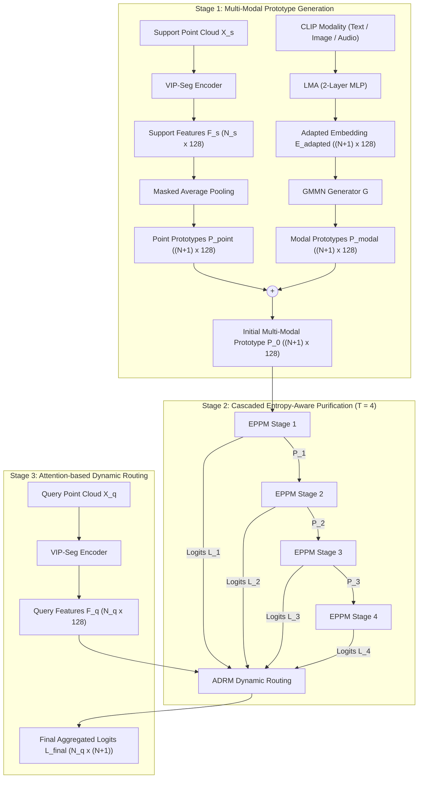
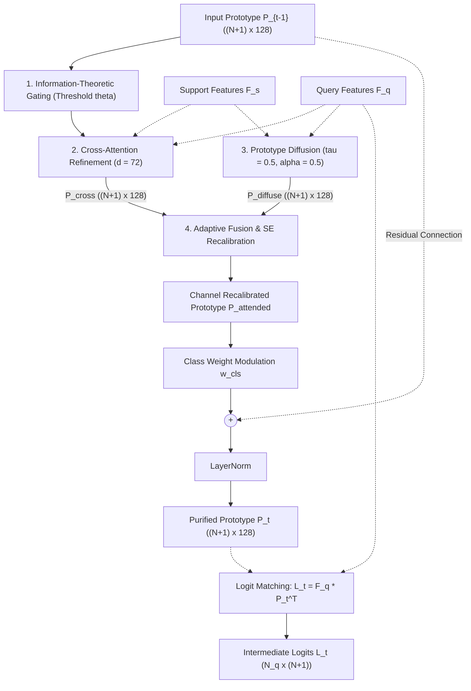

# 01_ARCHITECTURE_SPEC: Detailed Architectural & Module Specification

* **Reference Paper:** *CascadeProto: Cascaded Cross-Modal Prototype Purification via Entropy-Aware Learning for Few-Shot 3D Point Cloud Segmentation* (Wang et al., ECCV 2026).
* **Reference Repository Link:** [https://github.com/changshuowang/CascadeProto](https://github.com/changshuowang/CascadeProto).
* **Base Encoder Lineage:** VIP-Seg backbone architecture without external pre-training.

---

## 1. System Overview & Stage Execution

CascadeProto partitions few-shot point cloud segmentation into three discrete stages:
1. **Stage 1: Multi-Modal Prototype Generation:** Joint projection and fusion of point cloud geometric features and frozen CLIP modality representations.
2. **Stage 2: Cascaded Entropy-Aware Purification:** Iterative refinement of noisy prototypes through $T = 4$ cascaded Entropy-aware Prototype Purification Modules (EPPM).
3. **Stage 3: Attention-based Dynamic Routing:** Query-guided aggregation of intermediate predictions across all cascade stages via an Attention-based Dynamic Routing Mechanism (ADRM).

---

## 2. Structural Module Specifications

### Module A: Shared VIP-Seg Encoder
* **Role:** Extracts dense point-wise geometric feature representations from unstructured 3D coordinates.
* **Weight Sharing:** A single instance $f_{enc}$ processes both support point sets $X_s \in \mathbb{R}^{N_s \times 3}$ and query point sets $X_q \in \mathbb{R}^{N_q \times 3}$.
* **Point Budget:** $N_s = 2048$ points per support sample; $N_q = 2048$ points per query scene.
* **Output Dimension:** $F_s \in \mathbb{R}^{N_s \times D}$ and $F_q \in \mathbb{R}^{N_q \times D}$, where feature dimension $D = 128$.
* **Initialization:** Initialized from scratch; no pre-trained weights are utilized.

### Module B: Point-Based Prototype Extraction
* **Foreground Extraction:** For each category $k \in \{1, \dots, N\}$, foreground features are isolated using the support binary mask $Y_s$ and pooled via masked average pooling:
  $$P_{fg}^{(k)} = \frac{1}{|M_{fg}^{(k)}|} \sum_{i \in M_{fg}^{(k)}} F_{s, i}, \quad M_{fg}^{(k)} = \{i \mid Y_{s, i} = 1 \text{ and } \text{class}(i) = k\}$$
* **Background Extraction:** Background features across all support points are pooled uniformly:
  $$P_{bg} = \frac{1}{|M_{bg}|} \sum_{i \in M_{bg}} F_{s, i}, \quad M_{bg} = \{i \mid Y_{s, i} = 0\}$$
* **Point Prototype Matrix:** Stacked vertically to establish $P_{point} = [P_{bg}; P_{fg}^{(1)}; \dots; P_{fg}^{(N)}] \in \mathbb{R}^{(N+1) \times D}$.

### Module C: Learnable Modality Adapters (LMA) & GMMN Generator
* **Input Embeddings:** Normalized CLIP modality vector $E_{CLIP}^{(m)} \in \mathbb{R}^{(N+1) \times 512}$ where $m \in \{\text{text}, \text{image}, \text{audio}\}$.
* **Adapter Network Structure:** A 2-layer Multi-Layer Perceptron (MLP) mapping 2D representation spaces to 3D point cloud space:
  $$\text{Adapter}(E) = W_2 \cdot \text{ReLU}(\text{LayerNorm}(W_1 \cdot E + b_1)) + b_2$$
  * Layer 1: Linear projection $512 \to 128$, LayerNorm, ReLU, Dropout ($p = 0.1$).
  * Layer 2: Linear projection $128 \to 128$.
* **Generative Distribution Matcher ($G$):** A 3-layer MLP generator reconciling domain discrepancies between modality embeddings and point prototypes:
  * Input: Concatenation of adapted embedding $E_{adapted}^{(m)} \in \mathbb{R}^{(N+1) \times D}$ and standard normal noise vector $z \sim \mathcal{N}(0, I_D) \in \mathbb{R}^{(N+1) \times D}$, forming an input tensor of size $\mathbb{R}^{(N+1) \times 256}$.
  * Layer 1: Linear $256 \to 128$, ReLU.
  * Layer 2: Linear $128 \to 128$, ReLU.
  * Layer 3: Linear $128 \to 128$.
  * Output: Modal prototype matrix $P_{modal} \in \mathbb{R}^{(N+1) \times D}$.
* **Prototype Merging:** Initial multi-modal prototype is computed via point-wise residual addition:
  $$P_0 = P_{point} + P_{modal} \in \mathbb{R}^{(N+1) \times D}$$

---

## 3. Entropy-Aware Prototype Purification Module (EPPM)

The cascade employs $T = 4$ identical EPPM stages connected sequentially. Each stage $t \in \{1, \dots, T\}$ processes the incoming prototype $P_{t-1} \in \mathbb{R}^{(N+1) \times D}$, support features $F_s \in \mathbb{R}^{N_s \times D}$, and query features $F_q \in \mathbb{R}^{N_q \times D}$ through four specialized internal operations:

### Sub-Module 1: Information-Theoretic Gating
* **Principle:** Background features exhibit high Shannon entropy due to diverse clutter, whereas foreground points remain structured and low-entropy.
* **Normalization:** Channel responses are mapped to probabilities via sigmoid activation: $p_i = \sigma(x_i)$.
* **Shannon Entropy Formulation:**
  $$H_i = -p_i \log(p_i + \epsilon) - (1 - p_i) \log(1 - p_i + \epsilon), \quad \epsilon = 10^{-8}$$
* **Learnable Soft Gate:** Parameterized by scalar threshold $\theta$ (learnable parameter, initialized to $0.5$):
  $$g_i = \sigma(2(\theta - H_i)), \quad x_{gated} = x \odot g$$

### Sub-Module 2: Cross-Attention Refinement
* **Subspace Dimensionality:** Both query and support features are mapped into a lower-dimensional manifold $d = 72$ via $1 \times 1$ convolutions: $Q' = \varphi(F_q) \in \mathbb{R}^{N_q \times 72}$ and $S' = \varphi(F_s) \in \mathbb{R}^{N_s \times 72}$.
* **Correlation Attention Matrix:**
  $$A_{qs} = \text{softmax}\left(\frac{Q' (S')^\top}{\sqrt{72}}\right) \in \mathbb{R}^{N_q \times N_s}$$
  where $A_{qs}$ models dense point-to-point geometric correlations between query and support scenes.
* **Support Context Propagation & Prototype Cross-Attention:**
  Support features are transferred to the query space via correlation matrix $A_{qs}$:
  $$F_{qs} = A_{qs} F_s \in \mathbb{R}^{N_q \times D}$$
  The prototype representation is refined through cross-attention with query-aligned features:
  $$A_{proto} = \text{softmax}\left(\frac{\psi(P_{t-1}) \cdot \varphi(F_{qs})^\top}{\sqrt{72}}\right) \in \mathbb{R}^{(N+1) \times N_q}$$
  $$P_{cross} = A_{proto} \cdot F_{qs} \in \mathbb{R}^{(N+1) \times D}$$
  where $\psi, \varphi: \mathbb{R}^D \to \mathbb{R}^{72}$ denote linear projections ($1 \times 1$ convolutions) into the cross-attention subspace $d = 72$.
  *(Note: Alternatively, under direct support cross-attention: $A_{proto} = \text{softmax}\left(\frac{\psi(P_{t-1}) (S')^\top}{\sqrt{72}}\right) \in \mathbb{R}^{(N+1) \times N_s}$ and $P_{cross} = A_{proto} \cdot F_s \in \mathbb{R}^{(N+1) \times D}$)*.

### Sub-Module 3: Prototype Diffusion
* **Channel Activation Statistics:** Point-averaged channel activations are computed for both query and support branches:
  $$q_{ch} = \sigma\left(\frac{1}{N_q}\sum_{j=1}^{N_q} F_{q, j}\right), \quad s_{ch} = \sigma\left(\frac{1}{N_s}\sum_{j=1}^{N_s} F_{s, j}\right)$$
* **Activation Masks:** Gated with fixed threshold $\tau = 0.5$:
  $$m_q = \mathbb{I}[q_{ch} > 0.5], \quad m_s = \mathbb{I}[s_{ch} > 0.5], \quad m_{common} = m_q \odot m_s$$
* **Decomposed Diffusion Components:**
  $$c_{common} = \frac{q_{ch} + s_{ch}}{2} \odot m_{common}$$
  $$c_{unique} = \frac{q_{ch} \odot (m_q - m_{common}) + s_{ch} \odot (m_s - m_{common})}{2}$$
* **Diffused Prototype:** Blended with constant $\alpha = 0.5$ and broadcast across all $N+1$ classes:
  $$P_{diffuse} = 0.5 \cdot c_{common} + 0.5 \cdot c_{unique} \in \mathbb{R}^{(N+1) \times D}$$

### Sub-Module 4: Adaptive Fusion & Class-Weighted Output
* **Two-Layer MLP Aggregator:** Computes normalized weights between cross-attention and diffusion representations:
  $$w = \text{softmax}(f_{fusion}([P_{cross}; P_{diffuse}])) \in \mathbb{R}^2$$
  $$P_{combined} = w_1 P_{cross} + w_2 P_{diffuse} \in \mathbb{R}^{(N+1) \times D}$$
* **Squeeze-and-Excitation (SE) Recalibration:**
  $$a = \sigma(W_2 \cdot \text{ReLU}(W_1 \cdot \text{AvgPool}(P_{combined}))), \quad P_{attended} = P_{combined} \odot a$$
* **Class Weight Modulation:** Background attenuation vector $w_{cls} = [0.8, 1.0, \dots, 1.0] \in \mathbb{R}^{N+1}$ downweights background prototype updates:
  $$P_{weighted} = P_{attended} \odot w_{cls}$$
* **Residual Connection & LayerNorm:**
  $$P_t = \text{LayerNorm}(W_{out} \cdot \text{ReLU}(P_{weighted}) + P_{t-1}) \in \mathbb{R}^{(N+1) \times D}$$

---

## 4. Attention-Based Dynamic Routing Mechanism (ADRM)

Rather than evaluating predictions exclusively from final stage $P_4$, the model treats every cascade stage $t \in \{1, \dots, 4\}$ as a specialized predictor:
* **Intermediate Stage Logits:** Computed using matrix product matching:
  $$L_t = F_q (P_t)^\top \in \mathbb{R}^{N_q \times (N+1)}$$
* **Query Complexity Conditioning:** Global average pooling summarizes query scene characteristics:
  $$\bar{F}_q = \frac{1}{N_q} \sum_{j=1}^{N_q} F_{q, j} \in \mathbb{R}^D$$
* **Routing Gate Vector:** Computed via learnable projection matrix $W_g \in \mathbb{R}^{T \times D}$ ($T = 4, D = 128$):
  $$w_{gate} = \text{softmax}(W_g \bar{F}_q) \in \mathbb{R}^4$$
* **Final Aggregated Logits:**
  $$L_{final} = \sum_{t=1}^4 w_{gate}^{(t)} \cdot L_t \in \mathbb{R}^{N_q \times (N+1)}$$

---

## 5. Tensor Dimension Contract Table

All AI agents must ensure dimensions strictly conform to the following contract at every layer boundary:

| Tensor Description | Symbol | Dimensions | Data Type |
| :--- | :--- | :--- | :--- |
| Support Point Coordinates | $X_s$ | `[Batch, N_way * K_shot, 2048, 3]` | `torch.float32` |
| Query Point Coordinates | $X_q$ | `[Batch, 2048, 3]` | `torch.float32` |
| Extracted Support Features | $F_s$ | `[Batch, N_s, 128]` | `torch.float32` |
| Extracted Query Features | $F_q$ | `[Batch, 2048, 128]` | `torch.float32` |
| CLIP Frozen Embeddings | $E_{CLIP}$ | `[Batch, N_way + 1, 512]` | `torch.float32` |
| Adapted Modality Embeddings | $E_{adapted}$ | `[Batch, N_way + 1, 128]` | `torch.float32` |
| Point Prototype Matrix | $P_{point}$ | `[Batch, N_way + 1, 128]` | `torch.float32` |
| Synthesized Modal Prototypes | $P_{modal}$ | `[Batch, N_way + 1, 128]` | `torch.float32` |
| Stage $t$ Refined Prototype | $P_t$ | `[Batch, N_way + 1, 128]` | `torch.float32` |
| Cross-Attention Subspace | $Q', S'$ | `[Batch, 2048, 72]` | `torch.float32` |
| Intermediate Stage Logits | $L_t$ | `[Batch, 2048, N_way + 1]` | `torch.float32` |
| ADRM Routing Weights | $w_{gate}$ | `[Batch, 4]` | `torch.float32` |
| Final Output Logits | $L_{final}$ | `[Batch, 2048, N_way + 1]` | `torch.float32` |
