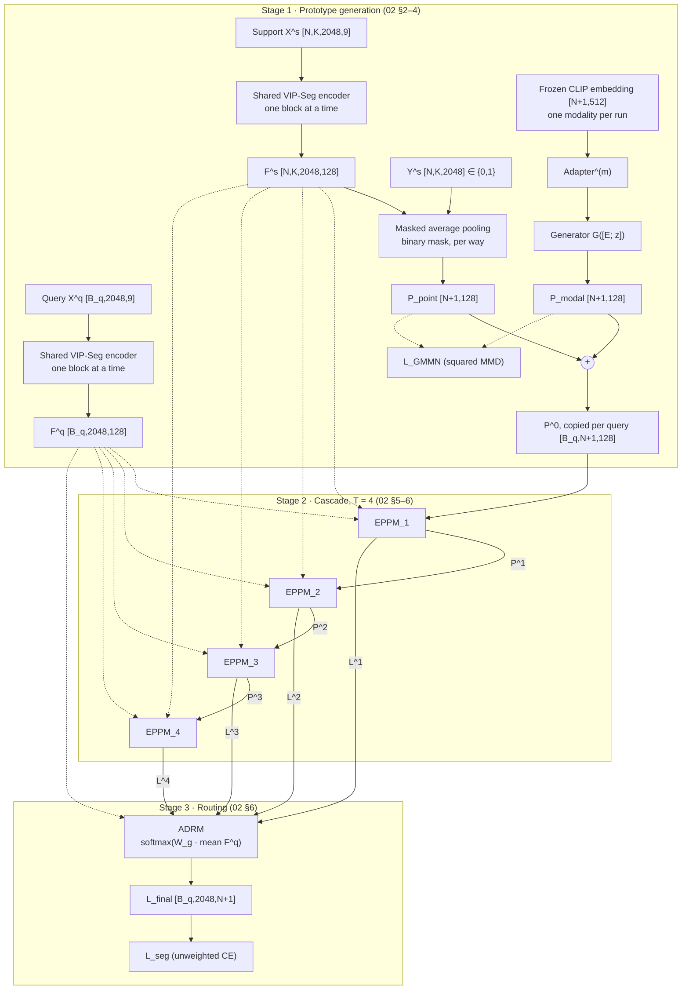
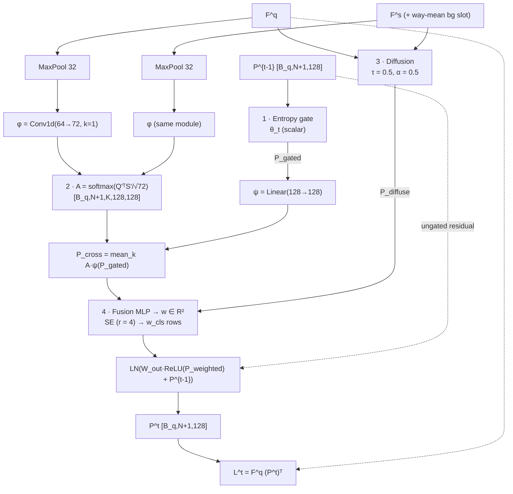

# 01_ARCHITECTURE_SPEC: Module Structure & Dataflow

* **Ground truth:** [00_SOURCES_AND_DECISIONS.md](00_SOURCES_AND_DECISIONS.md). Every normative line carries a source tag.
* **Scope:** which modules exist, how they are wired, their parameters and runtime requirements. All formulas and shapes are defined once in [02_TENSOR_MATH_SPEC.md](02_TENSOR_MATH_SPEC.md) and only referenced here (`02 §n`), so the two files cannot drift apart.
* **Rewritten:** 2026-09-17 (Phase 2).
* **Code status:** the code in `models/` and `loss/` predates this rewrite and does not yet follow it; see [the audit](../research/paper_vs_repo_audit.md).

---

## 1. Pipeline overview

CascadeProto runs one episode in three stages [PAPER §3.2] [PAPER Fig.1]:

1. **Multi-modal prototype generation:** shared encoder → point prototypes → LMA/generator → `P^0` [PAPER §3.3].
2. **Cascaded entropy-aware purification:** T = 4 EPPM stages producing `P^1..P^4` and logits `L^1..L^4` [PAPER §3.4–3.5].
3. **Dynamic routing:** ADRM mixes `L^1..L^4` into `L_final` [PAPER §3.5].

Sources for the diagram: [PAPER Fig.1] [PAPER Eq.2–9] [PAPER Eq.22–27] [DECISION D-01] [DECISION D-05].

---

## 2. Modules

### 2.1 Shared encoder

| Item | Specification | Source |
| :--- | :--- | :--- |
| Architecture | VIP-Seg encoder–decoder: `Encoder(input_points=2048, num_stages=3, embed_dim=60, k_neighbors=16, de_neighbors=10, alpha=1000, beta=30, num_experts=3)` | [PAPER §4.1] [VIPSEG models/vipseg.py:34-43] |
| Feature head | L2 norm → `BN(900)+ReLU` → `Conv1d(900→196)+BN+ReLU` → `Conv1d(196→128)+BN+ReLU` | [VIPSEG models/vipseg.py:45-53,85-97] |
| Input | 9 channels `xyz, rgb, XYZ`; the encoder uses `XYZ` (columns 6–8) as positions and `rgb` (3–5) as colour, and ignores columns 0–2 | [VIPSEG models/encoder.py:645] [VIPSEG scripts/vipseg_s3dis.sh] |
| Weight sharing | One instance for support and query | [PAPER §3.3 "The encoder is shared between support and query branches"] |
| Batching | Every block is its own sample: support `[N·K, 2048, 9]`, query `[B_q, 2048, 9]`, one encoder call each per episode. The encoder standardises with batch-wide statistics, so the batch composition must be exactly this (02 §2) | [PAPER Eq.2] [VIPSEG models/vipseg.py:79-81] [VIPSEG models/encoder.py:281-283,413-415,582-584] |
| Initialisation | From scratch; no pre-trained point-cloud weights | [PAPER Tab.1] [PAPER §1 "requires no pre-training"] [VIPSEG README.md] |
| Mamba | `mamba_ssm` is **required**. Import failure must stop the program; no fallback block | [VIPSEG models/encoder.py:22-23] [PAPER §4.1] |
| FPS | `pointnet2_ops` CUDA furthest-point sampling | [VIPSEG models/encoder.py:81] |
| Fixed projections | `vv`, `ww` = `torch.randn(1, 5000)`, drawn once at construction and shared by every low-/high-order convolution; they are plain attributes, not in a `state_dict`. VIP-Seg keeps them by pickling the whole model. `PointFeatureExtractor` registers them as buffers so saved checkpoints carry them; a VIP-Seg checkpoint is loaded with `load_vipseg_weights`, which copies them | [VIPSEG models/encoder.py:619-620,226,311] [VIPSEG runs/training.py:93-96] |
| Implementation | `models/vipseg_backbone.py::PointFeatureExtractor`; `encode_episode` encodes the N·K support blocks as one batch and the queries as another | [VIPSEG models/vipseg.py:79-97] |
| Output | `F^s [N,K,2048,128]`, `F^q [B_q,2048,128]`, all entries ≥ 0 | 02 §2 |

### 2.2 Point prototype extraction

* Masked average pooling of binary masks, one prototype per way, background from all ways and shots (02 §3) [PAPER Eq.3] [VIPSEG models/vipseg.py:108-130].
* No parameters.

### 2.3 Learnable Modality Adapter and generator

| Component | Layers | Params (D = 128) | Source |
| :--- | :--- | ---: | :--- |
| `Adapter^(m)`, one per modality | `Linear(512→128) → LN(128) → ReLU → Dropout(0.1) → Linear(128→128)` | 82,432 | [PAPER Eq.4–5] [DECISION D-16] |
| Generator G | `Linear(256→128) → ReLU → Linear(128→128) → ReLU → Linear(128→128)` | 65,920 | [PAPER Eq.6] [DECISION D-16] |

* Input: frozen, L2-normalised CLIP embedding `[N+1, 512]`, index 0 = background prompt [DECISION D-13].
* Noise z: sampled in training, zero in evaluation [DECISION D-06].
* Outputs `P_modal`; `P^0 = P_point + P_modal` (02 §4.5) [PAPER Eq.9].

### 2.4 EPPM stage (×T, parameters not shared)

| Sub-module | Parameters | Definition | Source |
| :--- | :--- | :--- | :--- |
| 1 Entropy gate | θ_t (1 scalar, init 0.5) | 02 §5.1 | [PAPER Eq.10–12] [DECISION D-02] |
| 2 Cross-attention | φ `Conv1d(64→72, bias=False)`, ψ `Linear(128→128)` | 02 §5.2 | [PAPER Eq.13–14] [DECISION D-01] |
| 3 Diffusion | none | 02 §5.3 | [PAPER Eq.15–18] [DECISION D-14] |
| 4 Fusion | `f_fusion` `Linear(256→128)+ReLU+Linear(128→2)` | 02 §5.4 | [PAPER Eq.19] [DECISION D-11] [DECISION D-16] |
| 4 SE | `W_1 Linear(128→32)`, `W_2 Linear(32→128)` | 02 §5.4 | [PAPER Eq.20] [DECISION D-16] |
| 4 Class weights | fixed `w_cls = [0.8, 1, …, 1]`, not learnable | 02 §5.4 | [PAPER §3.4] |
| 4 Output | `W_out Linear(128→128)`, `LayerNorm(128)` | 02 §5.4 | [PAPER Eq.21] [DECISION D-16] |
| Stage logits | none | 02 §5.5 | [PAPER Eq.23] [DECISION D-10] |

### 2.5 Cascade

* T = 4 stages in sequence, each with its own parameters and its own θ_t [PAPER Eq.22] [PAPER §3.5] [DECISION D-16].
* Every stage receives the same `F^s` and `F^q`; only the prototype flows from stage to stage [PAPER §3.4 "It takes as input the current prototype P^{t−1} along with support features F^s and query features F^q"].
* All T stage logits are kept for routing [PAPER §3.5].

### 2.6 ADRM

* `W_g ∈ R^{T×D}`, no bias; gate from the mean query feature; softmax over stages; weighted sum of stage logits (02 §6) [PAPER Eq.24–25].

### 2.7 Losses

* `L_total = L_seg + 1.0 · L_GMMN` (02 §7) [PAPER Eq.26].
* `L_seg`: unweighted cross-entropy on `L_final` only [PAPER Eq.27].
* `L_GMMN`: squared multi-scale MMD, background weight 0.1, foreground weight 1.0 (02 §4.3–4.4) [PAPER Eq.7–8] [DECISION D-04].

---

## 3. Ablation switches

Required configuration options. Defaults reproduce the full model. They live in `models/cascadeproto.py::CascadeProtoConfig` and on the `train.py` command line; every checkpoint stores its configuration and `eval.py` rebuilds the model from it. Until phase 13 lands, ADRM with `num_stages ≥ 2` raises `NotImplementedError`. Implemented: "Baseline" (`use_lma=false, num_stages=0`, `F^q P_pointᵀ`), "+ LMA" (`num_stages=0`, `F^q (P^0)ᵀ` plus `L_GMMN`), "+ Entropy Gate" (`num_stages=1`, `L^1`) and "+ Cascade" (`num_stages=T, use_adrm=false`, `L^T`) [DECISION D-17]. Non-default values of `cross_attn`, `gate_target` and `diffusion_input` raise.

| Option | Default | Values | Source |
| :--- | :--- | :--- | :--- |
| `use_lma` | true | true / false | [PAPER Tab.4] [DECISION D-17] |
| `use_gate` | true | true / false | [PAPER Tab.4] [DECISION D-17] |
| `num_stages` | 4 | 0–6 | [PAPER Tab.5] [DECISION D-17] |
| `use_adrm` | true | true / false | [PAPER Tab.4] [DECISION D-17] |
| `modality` | text | text (image, audio: not yet implemented, must raise) | [PAPER Eq.4] [DECISION D-13] |
| `cross_attn` | channel | channel (two_hop raises) | [DECISION D-01] |
| `cross_attn_scale` | sqrt_d | sqrt_d / sqrt_D | [DECISION D-01] |
| `gate_target` | prototype | prototype (features raises) | [DECISION D-02] |
| `gmmn_fg_mode` | joint | joint / per_class | [DECISION D-04] |
| `gmmn_detach_point` | false | true / false | [DECISION D-04] |
| `eval_noise` | zero | zero / sample (mean_of_M raises until M is chosen) | [DECISION D-06] |
| `clip_variant` | ViT-B/16 | any `clip.available_models()` name; no fallback | [DECISION D-13] |
| `logit_scale` | none | none / sqrt_D | [DECISION D-10] |
| `l2norm_point_proto` | false | true / false | [DECISION D-10] |
| `fusion_weight` | per_query | per_query / per_class | [DECISION D-11] |
| `diffusion_input` | post_relu | post_relu (pre_relu raises) | [DECISION D-14] |

---

## 4. Parameter budget

| Part | Expected | Source |
| :--- | :--- | :--- |
| Encoder | 2.37M once `mamba_ssm` is used | [VIPSEG log_s3dis_VIPSeg/log_S0_N2_K1_0.722026/log_vipseg.txt:5] [DECISION D-09] |
| Feature head (900→196→128 with BN) | 204,260 | §2.1 |
| Adapter + generator | 148,352 | §2.3 |
| One EPPM stage | 79,395 (φ 4,608 · ψ 16,512 · f_fusion 33,154 · SE 8,352 · W_out 16,512 · LN 256 · θ 1) | §2.4 |
| Cascade (T = 4) | 317,580 | §2.5 |
| ADRM | 512 | §2.6 |
| **Total** | ≈ 3.04M (encoder + head ≈ 2.57M, added modules 466,444) | [DECISION D-09] |

Table 6 reports 2.88M for CascadeProto and 2.76M for the whole VIP-Seg model, which includes VIP-Seg's own 0.19M prototype module [PAPER Tab.6] [VIPSEG log_s3dis_VIPSeg/log_S0_N2_K1_0.722026/log_vipseg.txt:2-8]. The paper therefore implies ≈ 0.31M for LMA + EPPM + ADRM, against 466,444 here. Table 6 is not an acceptance criterion; report measured values instead [DECISION D-09].
