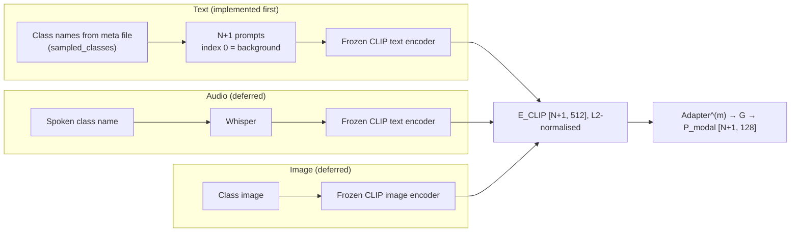

# 03_MULTIMODAL_SPEC: Modality Inputs, Adapters & Distribution Matching

* **Ground truth:** [00_SOURCES_AND_DECISIONS.md](00_SOURCES_AND_DECISIONS.md). Every normative line carries a source tag.
* **Scope:** how a semantic input (text, image or audio) becomes the `[N+1, 512]` CLIP embedding consumed by the Learnable Modality Adapter, the adapter/generator interface, and the implementation rules of the GMMN loss. The formulas themselves are defined once in [02_TENSOR_MATH_SPEC.md](02_TENSOR_MATH_SPEC.md) §4.
* **Rewritten:** 2026-09-17 (Phase 4). Claims without a source (a specific CLIP variant choice presented as paper content, Whisper "transcription" details, the background prompt, a `sqrt` MMD) were removed or turned into decisions.

---

## 1. What the paper specifies

| Item | Paper content | Source |
| :--- | :--- | :--- |
| Modalities | text, audio, image; each run uses **one** of them | [PAPER Eq.4] [PAPER Fig.1] [PAPER §1] |
| Encoder | "CLIP [17]"; variant not stated | [PAPER §3.3] [PAPER §4.1] |
| Embedding size | "each LMA projects CLIP embeddings from R^512 to R^128 via a two-layer MLP" | [PAPER §4.1] |
| Text input | Fig.1 example "This point cloud represents the chair" | [PAPER Fig.1] |
| Audio input | Fig.1 arrow: audio → Whisper → CLIP | [PAPER Fig.1] |
| Image input | Fig.1 arrow: image → CLIP | [PAPER Fig.1] |
| Adapter | one per modality, two-layer MLP with LayerNorm and Dropout | [PAPER Eq.4–5] |
| Generator | three-layer MLP `G(E_fused, z)`, `z ∼ N(0, I)` | [PAPER Eq.6] |
| Alignment | decoupled squared MMD, bg 0.1 / fg 1.0, σ ∈ {2, 5, 10, 20, 40, 80} | [PAPER Eq.7–8] |
| Fusion | `P^0 = P_point + P_modal` | [PAPER Eq.9] |

Not specified by the paper, therefore decided in [00](00_SOURCES_AND_DECISIONS.md): CLIP variant, background prompt, image/audio sources, how Whisper output enters CLIP, what `E_fused` is, noise at inference, dropout rate, layer widths [DECISION D-05] [DECISION D-06] [DECISION D-13] [DECISION D-16].

§3.2 of the paper says the adapters "project CLIP text and image embeddings" and the GMMN module "then fuses both sources". This conflicts with the single-modality design elsewhere and is resolved by [DECISION D-05]: one modality per run, `E_fused := E_adapted^(m)`.

---

## 2. Modality front-ends

Diagram sources: [PAPER Fig.1] [DECISION D-13].

### 2.1 Text (default)

| Rule | Source |
| :--- | :--- |
| Foreground prompt for class k: `"This point cloud represents the {name_k}."` | [PAPER Fig.1] [DECISION D-13] |
| Background prompt (row 0): `"This point cloud represents the background."` | [DECISION D-13] |
| `name_k` = the class-name file entry for `sampled_classes[k−1]`, verbatim | [DECISION D-13] |
| Row order: `[background, class 1, …, class N]`, same order as `P_point` | [PAPER Eq.3] [DECISION D-13] |
| CLIP variant from config, default `ViT-B/16`, written to the run log | [DECISION D-13] |
| Embedding = `encode_text` output, cast to float32, L2-normalised | [DECISION D-13] |
| CLIP is frozen, loaded **once** per process; embeddings cached per prompt string | [DECISION D-13] |

### 2.2 Audio and image (deferred)

* Selecting `modality=audio` or `modality=image` must raise an error until implemented; silently falling back to text is forbidden [DECISION D-13].
* Open items before implementation: source of per-class audio clips and images, CLIP image variant, whether the audio path uses Whisper's transcript or its embeddings [DECISION D-13].
* When implemented, the output contract is identical to text: `[N+1, 512]`, L2-normalised, row 0 = background [PAPER §4.1] [DECISION D-13].

---

## 3. Adapter and generator interface

| Item | Contract | Source |
| :--- | :--- | :--- |
| Input | `E_CLIP^(m)`: `[N+1, 512]` float32 | [PAPER §4.1] |
| Output | `P_modal`: `[N+1, 128]` | [PAPER Eq.6] |
| Weights | an independent `Adapter^(m)` per modality; one generator G per trained model (each run uses one modality) | [PAPER Eq.4] [PAPER Eq.6] [DECISION D-05] |
| Layers | 02 §4.1–4.2 | [PAPER Eq.5–6] [DECISION D-16] |
| Noise | fresh `z ∼ N(0, I)` of shape `[N+1, 128]` per episode in training; `z = 0` in evaluation | [PAPER Eq.6] [DECISION D-06] |
| Gradient | trained end to end with the segmentation network; CLIP receives no gradient | [PAPER Eq.26] [DECISION D-13] |
| Disabled (`use_lma=false`) | `P_modal ≡ 0` and `L_GMMN` omitted | [DECISION D-17] |

---

## 4. GMMN loss implementation rules

Formula: 02 §4.3–4.4 [PAPER Eq.7–8].

1. **Squared MMD, no square root, no epsilon inside a root** [PAPER Eq.7].
2. **Sets:** background = row 0 of `P_modal` vs row 0 of `P_point` (1 vs 1 sample); foreground = rows 1…N of each, compared as two sets of N samples [DECISION D-04].
3. **Weights:** `0.1 · MMD_bg + 1.0 · MMD_fg` [PAPER Eq.8].
4. **Kernel:** sum of six Gaussians, `exp(−‖x − y‖² / (2σ²))`, σ ∈ {2, 5, 10, 20, 40, 80}; pairwise squared distances clamped at ≥ 0 before the exponent (02 §9) [PAPER Eq.7].
5. **Gradients** flow into both `P_modal` and `P_point` [DECISION D-04].
6. **Batch:** computed per episode, averaged over the 4 episodes of a batch together with `L_seg` [PAPER Eq.26] [DECISION D-12].
7. **Size guard:** inputs are prototype rows only; assert set sizes are 1 and N (never point features) [PAPER Eq.8].

### 4.1 Reference values for tests

* `k(x, x) = 6` for any x.
* For single samples x, y: `MMD({x}, {y}) = 2 · (6 − k(x, y))`, which lies in `[0, 12)`.
* `MMD(X, X) = 0` for any set X.

These follow directly from the expansion in 02 §4.3 [PAPER Eq.7].
