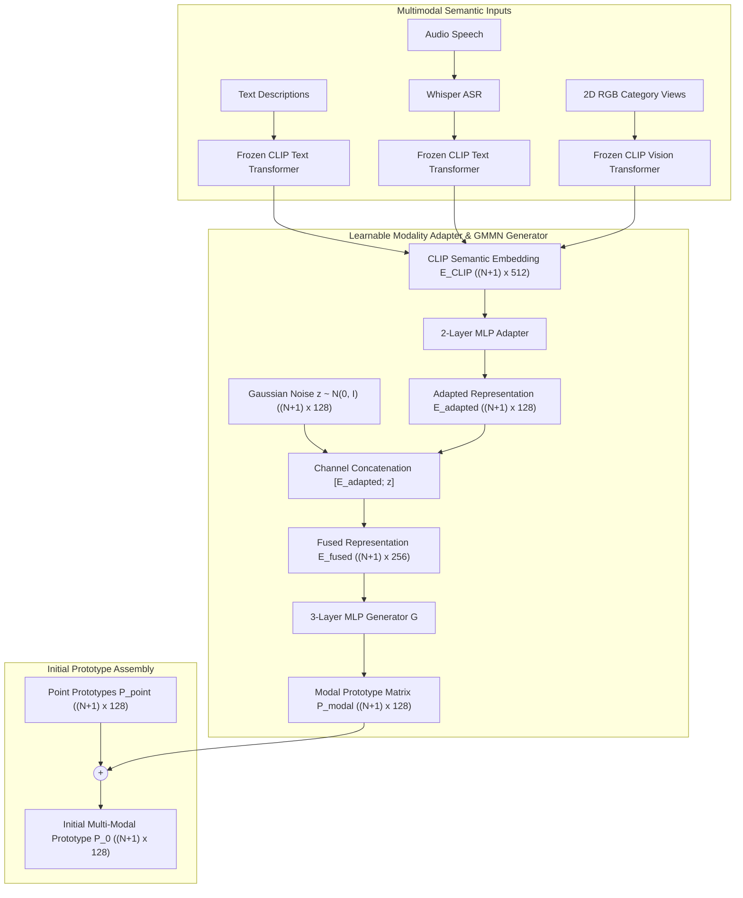

# 03_MULTIMODAL_SPEC: Multi-Modal Adapter Architecture & Cross-Modal Distribution Matching

* **Reference Paper:** *CascadeProto: Cascaded Cross-Modal Prototype Purification via Entropy-Aware Learning for Few-Shot 3D Point Cloud Segmentation* (Wang et al., ECCV 2026).
* **Reference Repository Link:** [https://github.com/changshuowang/CascadeProto](https://github.com/changshuowang/CascadeProto).
* **Pre-trained Encoders:** Frozen OpenAI CLIP (ViT-B/32 or ViT-B/16) and Whisper ASR.

---

## 1. Modality Pipelines & Feature Extraction

CascadeProto supports three separate single-modality semantic inputs (text, audio, image) to enrich geometric point prototypes. Each modality is projected into a shared semantic subspace using frozen pre-trained feature extractors before passing into modality-specific adapters.

### 1.1 Text Modality (Default Implementation Target)
* **Feature Extractor:** Frozen CLIP Text Transformer.
* **Token Template Formal Logic:**
  * Foreground classes $k \in \{1, \dots, N\}$ with class name $c_k$:
    $$\mathcal{T}_{fg}(c_k) = \text{“This point cloud represents the } c_k\text{.”}$$
  * Background class ($k = 0$):
    $$\mathcal{T}_{bg} = \text{“This point cloud represents the background clutter.”}$$
* **Embedding Matrix:** The $(N+1)$ text descriptions are tokenized and projected to output $E_{CLIP}^{(text)} \in \mathbb{R}^{(N+1) \times 512}$.

### 1.2 Audio Modality
* **Transcription Front-End:** Spoken category terms are converted to text tokens using pre-trained Whisper ASR.
* **Semantic Projection:** Transcribed category tokens are mapped to embeddings via the frozen CLIP text encoder, producing $E_{CLIP}^{(audio)} \in \mathbb{R}^{(N+1) \times 512}$.

### 1.3 Image Modality
* **Visual Front-End:** 2D representative RGB views of target categories are passed into the frozen CLIP Vision Transformer.
* **Visual Embeddings:** Extracted features form the modality tensor $E_{CLIP}^{(image)} \in \mathbb{R}^{(N+1) \times 512}$.

---

## 2. Learnable Modality Adapter (LMA) Architecture

To bridge the domain gap between 2D/language representations and 3D point cloud coordinate embeddings without fine-tuning CLIP weights, each modality uses an independent 2-layer MLP adapter:

$$\text{Adapter}(E) = W_2 \cdot \text{ReLU}(\text{LayerNorm}(W_1 \cdot E + b_1)) + b_2 \in \mathbb{R}^{(N+1) \times D}$$

* **Input Dimension:** $D_{CLIP} = 512$.
* **Layer 1:** Linear projection $W_1 \in \mathbb{R}^{D \times 512}$, $b_1 \in \mathbb{R}^D$ ($512 \to 128$), Layer Normalization, ReLU activation, Dropout ($p = 0.1$).
* **Layer 2:** Linear projection $W_2 \in \mathbb{R}^{D \times D}$, $b_2 \in \mathbb{R}^D$ ($128 \to 128$).
* **Adapted Representation:** $E_{adapted}^{(m)} \in \mathbb{R}^{(N+1) \times D}$, with $D = 128$.

---

## 3. Generative Distribution Matching Module (GMMN)

Direct addition of adapted embeddings to point prototypes causes misalignments due to distribution variance. CascadeProto generates synthesized modal prototypes via a Generative Moment Matching Network (GMMN):

### 3.1 Generator Structure ($G$)
* **Stochastic Perturbation:** A random standard normal noise vector $z \sim \mathcal{N}(0, I_D) \in \mathbb{R}^{(N+1) \times D}$ is concatenated with $E_{adapted}^{(m)}$ along the channel dimension:
  $$E_{fused} = [E_{adapted}^{(m)}; z] \in \mathbb{R}^{(N+1) \times 256}$$

* **Multi-Layer Generator Network Specification:**

  | Layer | Operation | Input Dimension | Output Dimension | Activation |
  | :--- | :--- | :--- | :--- | :--- |
  | Layer 1 | Linear Projection | $256$ | $128$ | ReLU |
  | Layer 2 | Linear Projection | $128$ | $128$ | ReLU |
  | Layer 3 | Linear Projection | $128$ | $128$ | None (Identity) |

* **Generated Prototype Matrix:**
  $$P_{modal} = G(E_{fused}) \in \mathbb{R}^{(N+1) \times 128}$$

### 3.2 Foreground-Background Decoupled Alignment Loss

The alignment between modal prototypes $P_{modal}$ and point prototypes $P_{point}$ is optimized via multi-scale Maximum Mean Discrepancy (MMD) with independent foreground and background weighting:

* **Pairwise Squared Euclidean Distance:**
  For prototype matrices $X \in \mathbb{R}^{M \times D}$ and $Y \in \mathbb{R}^{K \times D}$:
  $$D_{XY}^2(i, j) = \|x_i - y_j\|_2^2 = \|x_i\|_2^2 + \|y_j\|_2^2 - 2 \langle x_i, y_j \rangle$$

* **Multi-Scale Gaussian RBF Kernel:**
  Evaluated across six multi-scale bandwidths $\sigma \in \{2.0, 5.0, 10.0, 20.0, 40.0, 80.0\}$:
  $$K_{XY}(i, j) = \sum_{\sigma \in \{2, 5, 10, 20, 40, 80\}} \exp\left(-\frac{D_{XY}^2(i, j)}{2\sigma^2}\right)$$

* **Maximum Mean Discrepancy (MMD):**
  $$\text{MMD}(X, Y) = \sqrt{\max\left( \frac{1}{M^2}\sum_{i=1}^M \sum_{i'=1}^M K_{XX}(i, i') + \frac{1}{K^2}\sum_{j=1}^K \sum_{j'=1}^K K_{YY}(j, j') - \frac{2}{MK}\sum_{i=1}^M \sum_{j=1}^K K_{XY}(i, j), \; \epsilon \right)}$$
  where $\epsilon = 10^{-8}$ guarantees strict non-negativity and numerical stability under floating-point arithmetic.

* **Decoupled Objective Function:**
  Because background point clouds contain diverse clutter while foreground objects share structured semantics, the alignment objective decouples foreground and background distributions:
  $$\mathcal{L}_{GMMN} = 0.1 \cdot \text{MMD}(P_{modal}^{bg}, P_{point}^{bg}) + 1.0 \cdot \text{MMD}(P_{modal}^{fg}, P_{point}^{fg})$$
  where $P_{modal}^{bg} = P_{modal}[0:1, :] \in \mathbb{R}^{1 \times D}$ and $P_{modal}^{fg} = P_{modal}[1:, :] \in \mathbb{R}^{N \times D}$.

---

## 4. Polymorphic Modality Module Interface Logic

To allow seamless switching among modalities (Text, Image, Audio) without modifying downstream segmentation pipelines, all modality adapters follow an abstract polymorphic execution logic:

### 4.1 Interface Contract
* **Input Tensor:** Normalized CLIP embeddings $E_{CLIP} \in \mathbb{R}^{B \times (N+1) \times 512}$.
* **Output Tensor:** Modal prototypes $P_{modal} \in \mathbb{R}^{B \times (N+1) \times 128}$.
* **Parameter Independence:** Each modality maintains its own weights for the 2-layer Adapter and 3-layer Generator $G$, but shares identical dimension signatures.

### 4.2 Sequential Transformation Dataflow
1. **Projection Phase:** The input semantic embedding is adapted to geometric feature dimension $D = 128$:
   $$E_{adapted} = \text{Adapter}(E_{CLIP}) \in \mathbb{R}^{B \times (N+1) \times 128}$$
2. **Stochastic Sampling:** Sample random standard Gaussian noise independently for each episode:
   $$z \sim \mathcal{N}(0, I_D) \in \mathbb{R}^{B \times (N+1) \times 128}$$
3. **Channel Fusion:** Concatenate adapted features and noise along the channel dimension:
   $$E_{fused} = [E_{adapted}; z] \in \mathbb{R}^{B \times (N+1) \times 256}$$
4. **Prototype Synthesis:** Pass fused representations through the MLP generator:
   $$P_{modal} = G(E_{fused}) \in \mathbb{R}^{B \times (N+1) \times 128}$$

### 4.3 Modality Sub-Types
* **`TextModalityAdapter`:** Maps CLIP text transformer embeddings derived from structured category sentences into $P_{modal}$.
* **`ImageModalityAdapter`:** Maps CLIP visual transformer representations of 2D canonical category views into $P_{modal}$.
* **`AudioModalityAdapter`:** Maps Whisper-transcribed category audio tokens via CLIP text space into $P_{modal}$.

---

## 5. Initial Prototype Fusion Contract

After evaluating the point cloud prototypes $P_{point} \in \mathbb{R}^{(N+1) \times D}$ from the support features via masked average pooling and synthesizing $P_{modal} \in \mathbb{R}^{(N+1) \times D}$ from the selected modality adapter, the starting prototype $P_0$ for cascade input is assembled via residual summation:

$$P_0 = P_{point} + P_{modal} \in \mathbb{R}^{(N+1) \times 128}$$

* **Batch Shape:** `[Batch_Size, N_way + 1, 128]`.
* **Downstream Delivery:** $P_0$ serves as the input prototype to the first purification module $\text{EPPM}_1$.