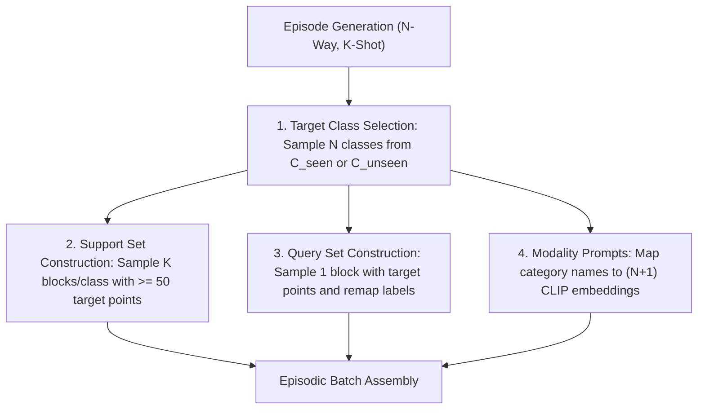

# 04_DATA_AND_EPISODES: Data Processing Protocol, Splits & Episodic Benchmark Setup

* **Reference Paper:** *CascadeProto: Cascaded Cross-Modal Prototype Purification via Entropy-Aware Learning for Few-Shot 3D Point Cloud Segmentation* (Wang et al., ECCV 2026).
* **Reference Repository Link:** [https://github.com/changshuowang/CascadeProto](https://github.com/changshuowang/CascadeProto).
* **Data Standards:** Block-based partitioning with 2048 points per block matching the AttMPTI / VIP-Seg protocol.

---

## 1. Dataset Specifications & Preprocessing

### 1.1 S3DIS (Stanford 3D Indoor Spaces Dataset)
* **Dataset Scale:** 272 indoor rooms collected across 6 large-scale architectural areas.
* **Semantic Categories (13 total):** `ceiling`, `floor`, `wall`, `beam`, `column`, `window`, `door`, `table`, `chair`, `sofa`, `bookcase`, `board`, `clutter`.
* **Area Partitioning:** Areas 1, 2, 3, 4, and 6 serve as the training set, while Area 5 is reserved exclusively for testing.
* **Point Sampling:** Point clouds are partitioned into standard regular spatial blocks, each containing exactly $N_p = 2048$ randomly sampled points with normalized 3D coordinates and RGB values.
* **Evaluation Splits:**
  * **Split $S_0$ Unseen Evaluation Classes (6 classes):** `ceiling`, `floor`, `wall`, `beam`, `column`, `window`.
  * **Split $S_1$ Unseen Evaluation Classes (6 classes):** `door`, `table`, `chair`, `sofa`, `bookcase`, `board`.
  * The `clutter` category is strictly designated as background ($k = 0$).

### 1.2 ScanNet Benchmark
* **Dataset Scale:** 1,513 RGB-D indoor scans annotated across 20 semantic object categories.
* **Dataset Splits:** 1,201 training scenes and 312 validation scenes.
* **Spatial Blocks:** The 312 validation scenes are pre-partitioned into 36,350 uniform blocks of 2,048 points each.
* **Sampling Protocol:** Points per block are normalized and sub-sampled to exactly $N_s = N_q = 2048$ points.

---

## 2. Episodic Sampling Protocol

Few-shot learning follows an episodic meta-learning paradigm where the network is trained on seen categories $\mathcal{C}_{seen}$ and evaluated on novel unseen categories $\mathcal{C}_{unseen}$.

### 2.1 Episode Configuration Matrix
Every episode evaluated across both benchmarks adheres strictly to the four configurations:
* **2-Way 1-Shot:** $N = 2$ classes, $K = 1$ support block per class.
* **2-Way 5-Shot:** $N = 2$ classes, $K = 5$ support blocks per class.
* **3-Way 1-Shot:** $N = 3$ classes, $K = 1$ support block per class.
* **3-Way 5-Shot:** $N = 3$ classes, $K = 5$ support blocks per class.

### 2.2 Algorithmic Episode Sampler Logic & Tensor Contract

#### Mathematical Definitions & Sets
Let the preprocessed point dataset be represented as a collection of blocks:
$$\mathcal{D} = \{(X_b, Y_b^{raw})\}_{b=1}^M$$
where $X_b \in \mathbb{R}^{N_p \times 3}$ denotes normalized 3D coordinates, $Y_b^{raw} \in \{0, 1, \dots, C-1\}^{N_p}$ denotes global dataset category IDs, and $N_p = 2048$ points per block. Let $\mathcal{C}_{pool} \subset \{1, \dots, C-1\}$ denote the active category pool ($\mathcal{C}_{seen}$ during training, $\mathcal{C}_{unseen}$ during testing).

#### Sequential Sampling Logic
1. **Target Category Selection:**
   Sample $N$ distinct target categories uniformly at random without replacement:
   $$\mathcal{C}_{target} = \{c_1, c_2, \dots, c_N\} \subset \mathcal{C}_{pool}, \quad |\mathcal{C}_{target}| = N$$

2. **Support Set Assembly ($S$):**
   For each category $c_k \in \mathcal{C}_{target}$ ($k \in \{1, \dots, N\}$):
   * Identify all candidate spatial blocks containing sufficient foreground points for class $c_k$:
     $$\mathcal{B}_{cand}(c_k) = \left\{ b \in \{1, \dots, M\} \;\middle|\; \sum_{i=1}^{N_p} \mathbb{I}[Y_{b, i}^{raw} = c_k] \ge 50 \right\}$$
   * Sample $K$ distinct block indices $\{b_{k, 1}, \dots, b_{k, K}\} \subset \mathcal{B}_{cand}(c_k)$ without replacement.
   * For each block $b_{k, j}$, extract point coordinates $X_s = X_{b_{k, j}}[:, :3] \in \mathbb{R}^{N_p \times 3}$ and construct the binary foreground mask:
     $$Y_{s, i}^{(k, j)} = \mathbb{I}[Y_{b_{k, j}, i}^{raw} = c_k] \in \{0, 1\}, \quad i \in \{1, \dots, N_p\}$$
   * Concatenate all samples into the support tensors:
     $$X_s \in \mathbb{R}^{(N \cdot K) \times 2048 \times 3}, \quad Y_s \in \mathbb{R}^{(N \cdot K) \times 2048}$$

3. **Query Set Assembly ($Q$):**
   * Identify all candidate query blocks containing at least 50 points belonging to at least one target class:
     $$\mathcal{B}_{query} = \left\{ b \in \{1, \dots, M\} \;\middle|\; \exists c_k \in \mathcal{C}_{target} \text{ s.t. } \sum_{i=1}^{N_p} \mathbb{I}[Y_{b, i}^{raw} = c_k] \ge 50 \right\}$$
   * Sample a single query block $b_q \in \mathcal{B}_{query}$ uniformly at random: $X_q = X_{b_q}[:, :3] \in \mathbb{R}^{1 \times 2048 \times 3}$.
   * Remap global ground-truth semantic IDs into episode-local categorical labels $\{0, 1, \dots, N\}$:
     $$Y_{q, i} = \begin{cases} k, & \text{if } Y_{b_q, i}^{raw} = c_k \text{ for some } k \in \{1, \dots, N\} \\ 0, & \text{otherwise (background clutter)} \end{cases}$$
     producing query label tensor $Y_q \in \{0, 1, \dots, N\}^{1 \times 2048}$.

#### Output Tensor Contract Table

| Tensor Field | Shape | Data Type | Value Range / Description |
| :--- | :--- | :--- | :--- |
| `support_x` | `[N * K, 2048, 3]` | `torch.float32` | Normalized 3D point coordinates $(x, y, z)$ |
| `support_y` | `[N * K, 2048]` | `torch.float32` | Binary foreground category masks $\{0.0, 1.0\}$ |
| `query_x` | `[1, 2048, 3]` | `torch.float32` | Query scene point coordinates $(x, y, z)$ |
| `query_y` | `[1, 2048]` | `torch.int64` | Local category ground-truth labels $\{0, 1, \dots, N\}$ |
| `selected_classes` | `List[int]` | `int` | Global dataset category IDs for the $N$ sampled classes |

---

## 3. Training & Optimization Hyperparameters

All agents and reproduction pipelines must strictly configure the optimizer, scheduler, and epoch budgets according to the paper specification:

| Parameter | S3DIS Setup | ScanNet Setup | Reference / Notes |
| :--- | :--- | :--- | :--- |
| **Encoder Backbone** | VIP-Seg ($D = 128$) | VIP-Seg ($D = 128$) | Scratch training, no external pre-training |
| **Cascade Depth ($T$)** | 4 Stages | 4 Stages | Optimal accuracy-efficiency trade-off |
| **Optimizer** | AdamW | AdamW | Cross-entropy + Decoupled GMMN loss |
| **Initial Learning Rate** | $1.0 \times 10^{-3}$ | $1.0 \times 10^{-3}$ | Scaled dot-product prototype matching |
| **Weight Decay** | $0.1$ | $0.1$ | L2 regularization coefficient |
| **LR Scheduler** | StepLR | StepLR | Factor $\gamma = 0.5$ applied every 10 epochs |
| **Total Epochs** | 50 Epochs | 30 Epochs | Convergence reached at ~50/30 epochs |
| **Batch Size** | 4 Episodes | 4 Episodes | Batch of episodic graphs |
| **Loss Balance ($\lambda$)** | $1.0$ | $1.0$ | $\mathcal{L}_{total} = \mathcal{L}_{seg} + 1.0 \cdot \mathcal{L}_{GMMN}$ |
| **Validation Budget** | 600 Episodes | 600 Episodes | Averaged over Splits $S_0$ and $S_1$ |

---

## 4. Evaluation Metric Formulation

Performance across all episodes is quantified using Mean Intersection-over-Union (mIoU) evaluated across unseen target foreground categories.

For an episode with $N$ target classes, the per-class IoU for class $k \in \{1, \dots, N\}$ is defined as:
$$\text{IoU}_k = \frac{\text{TP}_k}{\text{TP}_k + \text{FP}_k + \text{FN}_k}$$
where:
* $\text{TP}_k$: True positives (Query points with true label $k$ predicted as $k$).
* $\text{FP}_k$: False positives (Query points with true label $\ne k$ predicted as $k$).
* $\text{FN}_k$: False negatives (Query points with true label $k$ predicted as $\ne k$).

The per-episode mean IoU over all foreground target categories:
$$\text{mIoU} = \frac{1}{N} \sum_{k=1}^N \text{IoU}_k$$

The final reported benchmark metric is the average foreground mIoU across all 600 test episodes over both Splits $S_0$ and $S_1$:
$$\text{mIoU}_{Avg} = \frac{1}{2} \left(\text{mIoU}_{S_0} + \text{mIoU}_{S_1}\right)$$
