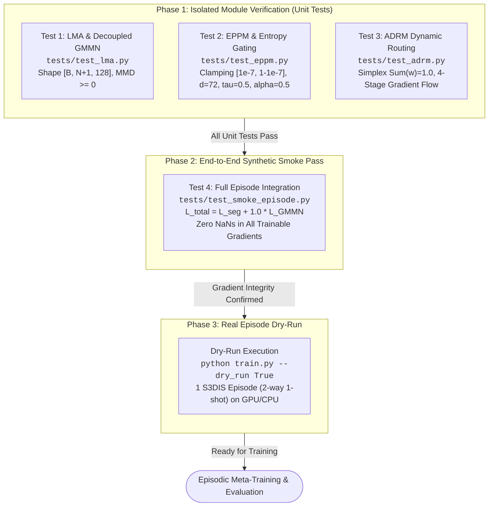

# 05_VERIFICATION_PLAN: Automated Unit Testing, Integrity Checks & Smoke Tests

* **Reference Paper:** *CascadeProto: Cascaded Cross-Modal Prototype Purification via Entropy-Aware Learning for Few-Shot 3D Point Cloud Segmentation* (Wang et al., ECCV 2026 / VIP-Seg NeurIPS 2025).
* **Reference Repository Link:** [https://github.com/changshuowang/CascadeProto](https://github.com/changshuowang/CascadeProto).
* **Testing Framework:** `pytest` with synthetic tensor fixtures (`torch.float32`, CUDA/CPU agnostic).

---

## 1. Test Suite Execution Protocol

All implementations must execute the verification suite in sequential phases before initiating training or evaluation pipelines:



### Execution Commands

```bash
# Phase 1: Isolated Module Unit Tests
pytest tests/test_lma.py -v
pytest tests/test_eppm.py -v
pytest tests/test_adrm.py -v

# Phase 2: End-to-End Synthetic Smoke Test (1 batch, forward + backward)
pytest tests/test_smoke_episode.py -v

# Phase 3: Dry-Run Episode Execution on Real S3DIS Dataloader
python train.py --dataset s3dis --cvfold 0 --n_way 2 --k_shot 1 --modality text --dry_run True
```

---

## 2. Unit Test Specifications & Verification Logic

### 2.1 Test Suite 1: Learnable Modality Adapter & Decoupled GMMN (`tests/test_lma.py`)

* **Objective:** Validate dimension projection $512 \to 128$, multi-scale RBF Gaussian kernel stability, decoupled foreground/background MMD computation, and gradient flow back to adapter parameters.

#### Input Fixtures & Data Contracts

| Tensor Symbol | Description | Data Type / Domain | Shape |
| :--- | :--- | :--- | :--- |
| $E_{text}$ | Synthetic CLIP text features | `float32`, $\mathcal{N}(0, 1)$ | $[B, N+1, 512]$ |
| $P_{point}$ | Ground-truth support point prototypes | `float32`, $\mathcal{N}(0, 1)$ | $[B, N+1, 128]$ |

#### Mathematical Invariant Assertions

1. **Projection Contract & Sanitization:**
   $$P_{modal} = f_{\theta_{lma}}(E_{text}) \in \mathbb{R}^{B \times (N+1) \times 128}$$
   $$\forall b, c, j: \quad \text{isnan}(P_{modal}[b, c, j]) = \text{False}$$

2. **Multi-Scale Gaussian RBF Kernel Stability:**
   $$K(x, x') = \sum_{\sigma \in \{2, 5, 10, 20, 40, 80\}} \exp\left(-\frac{\|x - x'\|_2^2}{2\sigma^2}\right)$$
   For bounded inputs, the Gram matrix diagonal elements satisfy $K(x, x) = 6.0$.

3. **Decoupled Distribution Alignment Non-Negativity:**
   $$\mathcal{L}_{GMMN} = 0.1 \cdot \text{MMD}^2\left(P_{modal}^{(0)}, P_{point}^{(0)}\right) + 1.0 \cdot \frac{1}{N} \sum_{c=1}^N \text{MMD}^2\left(P_{modal}^{(c)}, P_{point}^{(c)}\right)$$
   $$\text{Invariant:} \quad \mathcal{L}_{GMMN} \ge 0.0, \quad \text{and} \quad \text{dim}(\mathcal{L}_{GMMN}) = 0 \text{ (scalar)}$$

4. **Gradient Flow Integrity:**
   $$\nabla_{\theta_{lma}} \mathcal{L}_{GMMN} \neq \mathbf{0}, \quad \text{and} \quad \text{isnan}\left(\nabla_{\theta_{lma}} \mathcal{L}_{GMMN}\right) = \text{False}$$

---

### 2.2 Test Suite 2: Entropy-Aware Purification & Gating (`tests/test_eppm.py`)

* **Objective:** Validate Shannon entropy mathematical clamping under extreme activation values, cross-attention subspace dimensionality ($d = 72$), prototype diffusion ($\tau = 0.5, \alpha = 0.5$), and residual continuity.

#### Input Fixtures & Data Contracts

| Tensor Symbol | Description | Data Type / Domain | Shape |
| :--- | :--- | :--- | :--- |
| $P_{in}$ | Input prototypes | `float32`, $\mathcal{N}(0, 1)$ | $[B, N+1, 128]$ |
| $F_s$ | Support point features | `float32`, $\mathcal{N}(0, 1)$ | $[B, N_s, 128]$ ($N_s = 2048$) |
| $F_q$ | Query point features | `float32`, $\mathcal{N}(0, 1)$ | $[B, N_q, 128]$ ($N_q = 2048$) |

#### Mathematical Invariant Assertions

1. **Clamping & Shannon Entropy Stability:**
   For arbitrary raw channel logits $z \in [-1000.0, 1000.0]$:
   $$p = \text{clamp}\left(\sigma(z), 10^{-7}, 1 - 10^{-7}\right)$$
   $$H_i = -p_i \log(p_i + 10^{-8}) - (1 - p_i) \log(1 - p_i + 10^{-8})$$
   $$\text{Invariant:} \quad 0.0 \le H_i \le \log(2) \approx 0.693147, \quad \forall i \in \{1, \dots, D\}$$

2. **Cross-Attention Subspace Dimensionality:**
   Feature projections $W_Q, W_K \in \mathbb{R}^{128 \times 72}$ map representations to subspace $d = 72$. The attention affinity matrix satisfies:
   $$A_{qs} = \text{softmax}\left(\frac{(F_q W_Q)(F_s W_K)^T}{\sqrt{72}}\right) \in [0, 1]^{B \times N_q \times N_s}$$

3. **Diffusion Conservation:**
   Common prototype $P_{com}$ and unique components $P_{uni}$ blended with threshold $\tau = 0.5$ and weighting $\alpha = 0.5$ preserve prototype shape:
   $$P_{diff} \in \mathbb{R}^{B \times (N+1) \times 128}$$

4. **Output Contracts & Residual Flow:**
   $$P_{out} \in \mathbb{R}^{B \times (N+1) \times 128}, \quad S_t \in \mathbb{R}^{B \times N_q \times (N+1)}$$
   $$\nabla_{P_{in}} \mathcal{L} \neq \mathbf{0}, \quad \text{and} \quad \text{isnan}(\nabla_{P_{in}} \mathcal{L}) = \text{False}$$

---

### 2.3 Test Suite 3: Attention-Based Dynamic Routing (`tests/test_adrm.py`)

* **Objective:** Ensure routing weights sum to $1.0$, query-conditioning vector maps across $T = 4$ stages, convex combination is numerically sound, and loss backpropagates through all stages.

#### Input Fixtures & Data Contracts

| Tensor Symbol | Description | Data Type / Domain | Shape |
| :--- | :--- | :--- | :--- |
| $\{S_t\}_{t=1}^4$ | Stage logits from $T=4$ EPPMs | `float32`, $\mathcal{N}(0, 1)$ | 4 tensors of $[B, N_q, N+1]$ |
| $F_q$ | Query point features | `float32`, $\mathcal{N}(0, 1)$ | $[B, N_q, 128]$ |

#### Mathematical Invariant Assertions

1. **Routing Simplex Constraint:**
   With query global pooled descriptor $v_q = \frac{1}{N_q} \sum_{i=1}^{N_q} F_q^{(i)} \in \mathbb{R}^{B \times 128}$:
   $$\mathbf{w}_{gate} = \text{softmax}(W_g v_q) \in (0, 1)^{B \times 4}$$
   $$\left| \sum_{t=1}^4 w_{gate}^{(t)} - 1.0 \right| < 10^{-6}, \quad \forall b \in \{1, \dots, B\}$$

2. **Convex Logit Aggregation:**
   $$S_{final} = \sum_{t=1}^4 w_{gate}^{(t)} \cdot S_t \in \mathbb{R}^{B \times N_q \times (N+1)}$$

3. **Multi-Stage Gradient Flow:**
   Backpropagating loss $\mathcal{L} = \sum S_{final}$ guarantees non-zero gradients across all $T = 4$ intermediate stage logits:
   $$\forall t \in \{1, 2, 3, 4\}: \quad \|\nabla_{S_t} \mathcal{L}\|_2 > 0, \quad \text{and} \quad \text{isnan}(\nabla_{S_t} \mathcal{L}) = \text{False}$$

---

### 2.4 Test Suite 4: End-to-End Episode Smoke Pass (`tests/test_smoke_episode.py`)

* **Objective:** Verify end-to-end forward pass, joint loss calculation $\mathcal{L}_{total} = \mathcal{L}_{seg} + 1.0 \cdot \mathcal{L}_{GMMN}$, backward autodiff graph, and optimizer parameter updates on a synthetic episodic batch.

#### Input Fixtures & Synthetic Episode Configuration

| Configuration Parameter | Symbol | Value |
| :--- | :--- | :--- |
| Batch Size | $B$ | $1$ |
| Ways / Foreground Classes | $N$ | $2$ (Total classes $N+1 = 3$: index $0$ bg, indices $1, 2$ fg) |
| Shots | $K$ | $1$ |
| Support Point Coordinates | $X_s$ | $[1, 2, 2048, 3]$, `float32` |
| Support Binary Masks | $Y_s$ | $[1, 2, 2048]$, `float32` $\in \{0.0, 1.0\}$ |
| Query Point Coordinates | $X_q$ | $[1, 2048, 3]$, `float32` |
| Query Labels | $Y_q$ | $[1, 2048]$, `int64` $\in \{0, 1, 2\}$ |
| CLIP Text Embeddings | $E_{text}$ | $[1, 3, 512]$, `float32` |

#### Verification Logic & Invariant Assertions

1. **Full Forward Execution:**
   $$(S_{final}, P_{modal}, P_{point}) = \text{CascadeProto}(X_s, Y_s, X_q, E_{text})$$
   $$S_{final} \in \mathbb{R}^{1 \times 2048 \times 3}, \quad P_{modal} \in \mathbb{R}^{1 \times 3 \times 128}, \quad P_{point} \in \mathbb{R}^{1 \times 3 \times 128}$$

2. **Joint Loss Aggregation:**
   $$\mathcal{L}_{seg} = \text{CrossEntropy}(S_{final}, Y_q; w_{cls}), \quad w_{cls} = [0.8, 1.0, 1.0]$$
   $$\mathcal{L}_{GMMN} = \text{DecoupledMMD}(P_{modal}, P_{point})$$
   $$\mathcal{L}_{total} = \mathcal{L}_{seg} + 1.0 \cdot \mathcal{L}_{GMMN}$$

3. **Full-Graph Autodiff & Gradient Sanitization:**
   $$\forall \theta \in \Theta_{\text{trainable}}: \quad \nabla_\theta \mathcal{L}_{total} \neq \text{None}, \quad \text{and} \quad \text{isnan}(\nabla_\theta \mathcal{L}_{total}) = \text{False}$$

4. **Optimizer Step Integrity:**
   One step of AdamW ($\eta = 10^{-3}$, weight decay $= 0.1$) executes successfully without parameter divergence.

---

## 3. Verification Acceptance Matrix

An agent's implementation is considered correct only when every criterion in this matrix passes without warning:

| Component | Target Functionality | Mathematical Success Criteria |
| :--- | :--- | :--- |
| **LMA** | Dimension Projection | Output strictly $P_{modal} \in \mathbb{R}^{B \times (N+1) \times 128}$, zero NaNs |
| **GMMN Loss** | Decoupled Distribution Alignment | Non-negative scalar $\mathcal{L}_{GMMN} \ge 0$, decoupled weights $0.1$ bg, $1.0$ fg, multi-scale $\sigma \in \{2, 5, 10, 20, 40, 80\}$ |
| **Entropy Gate** | Shannon Information Filtering | Probabilities clamped to $[10^{-7}, 1 - 10^{-7}]$, entropy $H_i \in [0, \log 2]$ |
| **Cross-Attention** | Subspace Geometry Mapping | $1 \times 1$ conv projection to $d = 72$, affinity matrix $A_{qs} \in [0, 1]^{B \times N_q \times N_s}$ |
| **Diffusion** | Co-activation Blending | Activation threshold $\tau = 0.5$, common-unique blending factor $\alpha = 0.5$, dimension invariant $D = 128$ |
| **Cascade ($T=4$)** | Progressive Purification | $P_0 \to P_1 \to P_2 \to P_3 \to P_4$ sequentially linked with residual flow |
| **ADRM** | Dynamic Logit Routing | Softmax simplex $\sum_{t=1}^4 w_{gate}^{(t)} = 1.0 \pm 10^{-6}$, all 4 stages receive non-zero gradients |
| **Full Pipeline** | End-to-End Autodiff Pass | $\mathcal{L}_{total} = \mathcal{L}_{seg} + 1.0 \cdot \mathcal{L}_{GMMN}$ completes with zero NaNs and valid weight updates |
